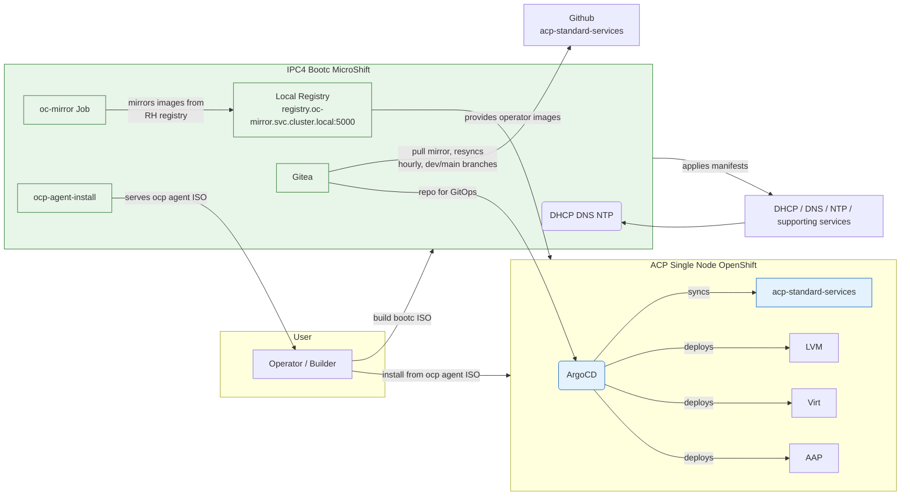

# How the SPS-2025 demo setup works

This document explains the end-to-end flow: building the IPC4 boot image, what the image places into MicroShift on IPC4, how the local mirror and Gitea/GitOps are wired, and what the ACP Single Node receives when installed with the generated agent ISO.

## 1) Build the IPC4 boot image

- Build example (from repo):

```bash
podman build images/ipc4/ --tag localhost/ipc4:latest --build-arg-file=build-args.txt
```

- The build uses the Containerfile at [images/ipc4/Containerfile](images/ipc4/Containerfile) which is based on a MicroShift bootc image. During the image build the Containerfile:
  - Registers RHEL subscription (build args `RHSM_ORG`, `RHSM_AK`).
  - Installs required tools (`podman`, `oc` clients, `microshift-olm`, `skopeo`, `nmstate`, etc.).
  - Copies MicroShift configuration files and assets into the image (`/etc/microshift/config.yaml`, `/etc/microshift/ovn.yaml`, storage config).
  - Adds a set of prepared Kubernetes manifests into `/etc/microshift/manifests.d/<component>` using `ADD` (see next section). These manifests are applied automatically by MicroShift at startup.
  - Adds helper scripts such as `get-microshift-kubeconfig.sh` and network/storage setup systemd units executed at first boot.

## 2) What runs on IPC4 MicroShift after boot

MicroShift watches `/etc/microshift/manifests.d/` and will create the resources found in each subdirectory.

Key manifest groups added by the Containerfile:

- DHCP: [images/ipc4/dhcp](images/ipc4/dhcp)
  - ConfigMap with `dnsmasq` configuration and a DaemonSet that runs dnsmasq on the host network to serve `192.168.100.0/24` addresses.

- DNS: [images/ipc4/dns](images/ipc4/dns)
  - ConfigMap with `named` configuration (forward/reverse zones) and a DaemonSet running `named` on the host network.

- NTP: [images/ipc4/ntp](images/ipc4/ntp)
  - Namespace, ServiceAccount, SCC/ClusterRole/RoleBinding, a ConfigMap with `chrony` config and a DaemonSet that runs `chronyd` on host network so hosts on the demo LAN can sync time.

- Gitea and Gitea Operator: [images/ipc4/gitea](images/ipc4/gitea) and [images/ipc4/gitea-operator](images/ipc4/gitea-operator)
  - `gitea-operator` is installed via an Operator `CatalogSource` and `Subscription` so the operator will manage `Gitea` CRs.
  - There is a `Job` (`deploy-gitea`) which applies a `Gitea` CR from a ConfigMap; a follow-up job sets up the admin user; another job (`mirror-repo`) creates a mirror of `https://github.com/RedHatEdge/acp-standard-services-public.git` into the local Gitea instance. See [images/ipc4/gitea/job.yaml](images/ipc4/gitea/job.yaml) and [images/ipc4/gitea/configmap.yaml](images/ipc4/gitea/configmap.yaml).

- oc-mirror / local mirror: [images/ipc4/oc-mirror](images/ipc4/oc-mirror)
  - A ConfigMap contains an `ImageSetConfiguration` (see [images/ipc4/oc-mirror/configmap.yaml](images/ipc4/oc-mirror/configmap.yaml)) which instructs `oc-mirror` to mirror operators catalogs (including the RedHat catalog and the local `gitea-catalog`) and additional images into the local registry `registry.oc-mirror.svc.cluster.local:5000` on IPC4.
  - A Job runs `oc-mirror` to populate the local mirror. This makes operator catalog images and container images available offline for the ACP install process.

- OCP agent install generator: [images/ipc4/ocp-agent-install](images/ipc4/ocp-agent-install)
  - Contains a ConfigMap with files used to generate an agent ISO for installing ACP.
  - The job in this manifest generates an agent installation ISO and serves it from IPC4 so you can download and use it to install ACP on target hardware. See [images/ipc4/ocp-agent-install/configmap.yaml](images/ipc4/ocp-agent-install/configmap.yaml).

Other helpers placed by the image include networking and storage setup systemd units and a `get-microshift-kubeconfig.sh` helper to extract the MicroShift kubeconfig.

## 3) GitOps wiring: Gitea → ArgoCD → ACP services

### 3a) Gitea is a *live pull mirror*, not a one-time copy

When the `mirror-repo` Job runs (see [images/ipc4/gitea/job.yaml](images/ipc4/gitea/job.yaml)), it doesn't just clone `https://github.com/RedHatEdge/acp-standard-services-public.git` into Gitea once — it registers Gitea's `admin/acp-standard-services-public` repo as a **pull mirror** (Gitea API `POST /repos/migrate` with `"mirror": true, "mirror_interval": "1h"`). From then on, **Gitea automatically re-fetches from GitHub every hour**, for as long as IPC4 runs.

This matters for two reasons:

- **Any branch that also exists upstream on GitHub (e.g. `dev`, `main`) gets kept in sync with upstream on every cycle.** Pushing commits directly to one of these branches in Gitea is not durable — the next hourly sync fetches from GitHub and updates the branch to match, discarding anything upstream doesn't have.
- **Gitea mirrors default to `enable_prune = true`**, which also *deletes* any local-only branch that doesn't exist upstream, on every sync. So even a brand-new, uniquely-named branch created only in Gitea isn't safe from a mirror sync until prune is turned off for that repo.

Prune has been disabled for this specific mirror (`enable_prune = false`, confirmed directly via Gitea's `mirror` table and its `PATCH /api/v1/repos/{owner}/{repo}` `enable_prune` field — this is a real, working API field on Gitea 1.25.4, despite some older Gitea versions/docs not exposing it). The `mirror-repo` Job now does this automatically right after creating the mirror, so it's set correctly on any future fresh install too — see [images/ipc4/gitea/job.yaml](images/ipc4/gitea/job.yaml). With prune off, a genuinely new, Gitea-local-only branch survives the hourly sync indefinitely; see [§5, Lab customization workflow](#5-lab-customization-workflow-dedicated-branch) below for how that's actually used.

### 3b) ArgoCD Application structure: one bootstrap Application, several rendered children

The OCP agent install process (created by the `ocp-agent-install` manifests) creates exactly **one** ArgoCD `Application` on the ACP cluster, once, during initial install. See the `apply-acp-standard-services` Job embedded in [images/ipc4/ocp-agent-install/configmap.yaml](images/ipc4/ocp-agent-install/configmap.yaml) — a plain `batch/v1 Job` (not a CronJob, doesn't re-run on its own) that waits for cluster operators to be healthy, then `oc apply`s:
  - A repository `Secret` for ArgoCD pointing at the local Gitea repo.
  - An ArgoCD `Application` named `acp-standard-services`, pointing at `charts/acp-standard-services` in the mirrored repo, `targetRevision: dev`, with a Helm `values` block baked directly into the Job's manifest.

`charts/acp-standard-services` is an **umbrella/app-of-apps Helm chart** — each template under its `templates/` directory (`local-storage.yaml`, `virtualization.yaml`, `it-automation.yaml`, `pipelines.yaml`, `network-interface-management.yaml`, ...) renders a **child** `Application` object, gated behind a `{{- with .Values.<key> }}` block: if that key isn't set in the parent's values, the child Application simply never gets created. So enabling a new service (e.g. Pipelines, or a bridged network interface) means adding the corresponding key to the *parent* Application's values — it doesn't require a new top-level Application.

```
acp-standard-services (the only Application created directly, by the one-shot bootstrap Job)
├─ values.localStorage                → child Application "local-storage"
├─ values.virtualization              → child Application "virtualization"
├─ values.itAutomation                → child Application "it-automation"
├─ values.pipelines                   → child Application "pipelines"
└─ values.networkInterfaceManagement  → child Application "network-interface-management"
```

None of these 5 Applications have `ownerReferences`, and there's no `ApplicationSet` on the cluster — ArgoCD's own reconciliation never touches the parent Application's spec.

### 3c) What's git-tracked, and what's the real durability gap

- **Git-tracked** (auto-syncs normally, `selfHeal: true`): everything under `charts/*/templates/` in the repo. Push a change to the branch ArgoCD is watching, it picks it up within the sync window.
- **NOT git-tracked**: the root `acp-standard-services` Application's own `spec.source.helm.values` — the values that decide which child Applications exist and how they're configured. This only lives in two places: (1) live on the cluster (`oc patch application ...` for immediate effect), and (2) baked into the one-shot bootstrap Job's heredoc in `images/ipc4/ocp-agent-install/configmap.yaml` in **this** repo.

Because the bootstrap Job only ever runs once (at initial cluster install), a live patch to the Application's values takes effect immediately and is safe from ArgoCD reverting it — but is **not** safe from a future reinstall, which would recreate the bootstrap Job fresh and re-apply whichever values were baked into this repo's `images/ipc4/ocp-agent-install/configmap.yaml` at ISO-build time, silently reverting any live-only changes. **To make a change durable, update both**: the live Application (immediate effect) and the bootstrap Job's values in this repo, synced to IPC4's `/etc/microshift/manifests.d/ocp-agent-install/configmap.yaml` (this doesn't affect the *currently running* ACP cluster — only the *next* generated install ISO).

The `acp-standard-services` app also sets local storage configuration (device classes, force-wipe options), virtualization flags, and other values that control how services are deployed on the ACP nodes. Refer to the `apply-acp-standard-services` job in [images/ipc4/ocp-agent-install/configmap.yaml](images/ipc4/ocp-agent-install/configmap.yaml) for the exact applied YAML fragment.

Key operator/components enabled at initial install (see the rendered manifest in the [ConfigMap](images/ipc4/ocp-agent-install/configmap.yaml)):

- `ansible-automation-platform-operator` (stable-2.6)
- `kubernetes-nmstate-operator`
- `kubevirt-hyperconverged`
- `lvms-operator`
- `openshift-gitops-operator` (ArgoCD)

`openshift-pipelines-operator-rh` was added later, live, following the durable two-step process above — see [Troubleshoot-July2026.md](Troubleshoot-July2026.md) for the full story (it also required mirroring the operator into IPC4's local registry first, since it wasn't part of the original `ImageSetConfiguration`).

## 4) Typical run sequence (high level)

1. Build `images/ipc4` image and create an ISO from it (script `scripts/create-iso.sh` is provided).
2. Boot the target machine from the generated ISO (this becomes IPC4). MicroShift starts and applies manifests from `/etc/microshift/manifests.d`.
3. MicroShift brings up DHCP/DNS/NTP/Gitea and the oc-mirror/local registry. `oc-mirror` job mirrors operator catalogs/images into the local registry.
4. Gitea is created and the `acp-standard-services-public` repository is registered as a **pull mirror** of GitHub (re-syncs every hour, for as long as IPC4 runs — see §3a).
5. The ocp-agent-install manifests generate and serve an agent ISO that you download and use to install ACP on target hardware. When ACP finishes installing and ArgoCD becomes available, the `apply-acp-standard-services` job creates an ArgoCD Application pointing at the mirrored repo.
6. ArgoCD syncs `acp-standard-services` and deploys the operators/services (ansible AAP, kubevirt, LVMS, etc.) onto the ACP cluster.

## 5) Lab customization workflow (dedicated branch)

Chart customizations specific to this lab (things upstream `RedHatEdge/acp-standard-services-public` has no reason to know about — e.g. a bridged network interface for a specific NIC on this specific node) should **not** be pushed to `dev`. Since `dev` is the branch ArgoCD watches *and* the branch Gitea keeps in sync with upstream every hour, any local commits on it are at real risk of being silently discarded the next time the mirror syncs (see §3a).

The pattern instead:

1. **Create a new branch that does not exist upstream** — e.g. `ipc4-local` — directly in Gitea. Because prune is now disabled for this mirror (§3a), a branch with no upstream counterpart is not touched by the hourly sync: it won't be force-updated (nothing to sync from) and won't be pruned (prune is off).
2. Push lab-specific chart changes to that branch (new `NodeNetworkConfigurationPolicy`/`NetworkAttachmentDefinition` entries, values overrides, anything that only makes sense for this specific ACP node's hardware).
3. Point the specific ArgoCD Application(s) that need the customization at that branch via `targetRevision`, rather than `dev` — this can be done per-Application, so most services can stay on `dev` (tracking upstream) while only the customized ones point at `ipc4-local`.
4. Before trusting a new branch for anything real, verify it actually survives a sync cycle: push a throwaway commit, wait past the mirror's 1-hour interval (or trigger "Synchronize Now" from Gitea's repo settings), confirm the commit is still there.

This keeps the lab's local hardware-specific configuration clearly separated from anything that could plausibly be upstreamed, while still benefiting from `dev` tracking real updates from `RedHatEdge/acp-standard-services-public` for everything else.

## 6) Where to look in this repo

- Boot image Containerfile: [images/ipc4/Containerfile](images/ipc4/Containerfile)
- MicroShift manifests placed into the image:
  - DHCP: [images/ipc4/dhcp](images/ipc4/dhcp)
  - DNS: [images/ipc4/dns](images/ipc4/dns)
  - NTP: [images/ipc4/ntp](images/ipc4/ntp)
  - Gitea: [images/ipc4/gitea](images/ipc4/gitea)
  - Gitea operator: [images/ipc4/gitea-operator](images/ipc4/gitea-operator)
  - oc-mirror: [images/ipc4/oc-mirror](images/ipc4/oc-mirror)
  - ocp-agent-install: [images/ipc4/ocp-agent-install](images/ipc4/ocp-agent-install)
- Deeper ArgoCD Application / umbrella-chart mechanics: [SNO-GitOps-Workflow.md](SNO-GitOps-Workflow.md)
- Incident history and root-cause writeups (IPC4/IPC3/ACP): [Troubleshoot-July2026.md](Troubleshoot-July2026.md)

## 7) Troubleshooting tips

- If `oc-mirror` fails while pinning manifests (for example due to a missing `gcr.io/kubebuilder/kube-rbac-proxy` manifest), you can either:
  - Patch the operator catalog bundle to replace the broken image reference with a maintained image (rebuild/push the catalog and point your `ImageSetConfiguration` at it), or
  - Mirror a compatible `kube-rbac-proxy` image into the local registry and edit the CSV references to use the local registry path.

- Check MicroShift-managed pods and static manifests with `oc get pods -A` (after extracting kubeconfig with `get-microshift-kubeconfig.sh`).
- To inspect what `oc-mirror` will mirror, read [images/ipc4/oc-mirror/configmap.yaml](images/ipc4/oc-mirror/configmap.yaml).

## Checklist — step by step

1. Build the IPC4 image:

```bash
podman build images/ipc4/ --tag localhost/ipc4:latest --build-arg-file=build-args.txt
```

2. Create the installation ISO (example):

```bash
scripts/create-iso.sh localhost/ipc4:latest $(pwd)/kickstarts/example.ks ~/Downloads/rhel-9.6-x86_64-boot.iso ./ipc4.iso
```

3. Boot the target machine with the ISO (becomes IPC4). Wait for MicroShift to start.

4. Extract MicroShift kubeconfig on IPC4 (or locally after mounting):

```bash
get-microshift-kubeconfig.sh
oc --kubeconfig ~/.kube/microshift-config get pods -A
```

5. Verify core services on MicroShift:
- `oc get pods -A` — check `dhcp`, `dns`, `oc-mirror`, `gitea`, `ocp-agent-install` namespaces.

6. Run or verify the `oc-mirror` Job completes and the local registry at `registry.oc-mirror.svc.cluster.local:5000` is populated.

7. Confirm Gitea repo exists and is mirrored (the `mirror-repo` Job creates `acp-standard-services-public`).

8. Download the generated agent ISO from IPC4 (URL served by ocp-agent-install) and use it to install ACP on target hardware.

9. After ACP install, ArgoCD and the `apply-acp-standard-services` Job (run on MicroShift or in ACP, depending on flow) will create an ArgoCD Application that points to `http://code-gitea.apps.ipc4.sps2025.com/admin/acp-standard-services-public.git`.

10. Verify ArgoCD syncs `acp-standard-services` and the listed operators (AAP, kubevirt, LVMS, openshift-gitops) get installed on ACP.

## Architecture diagram



