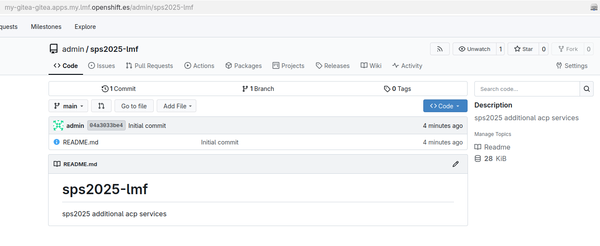
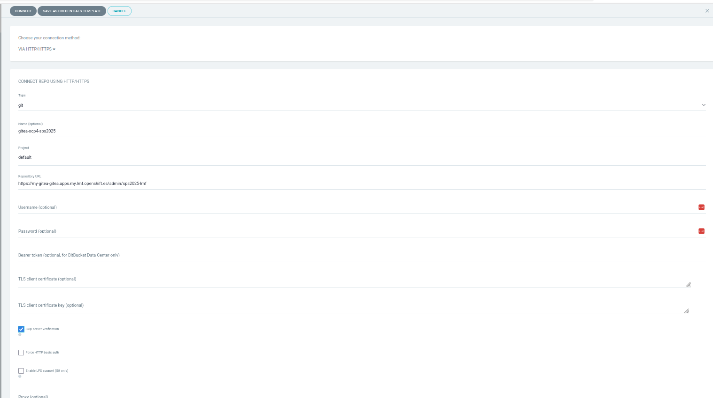
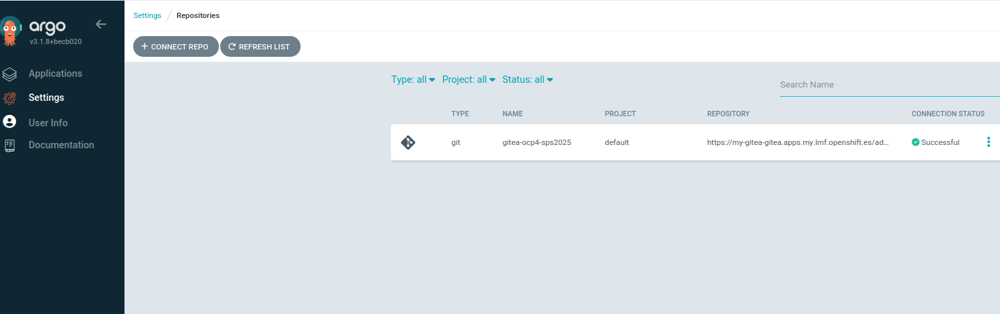
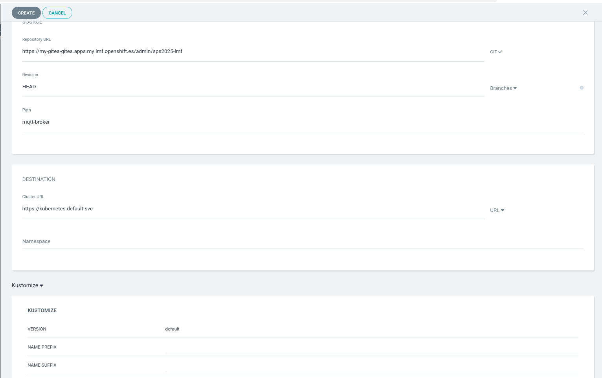
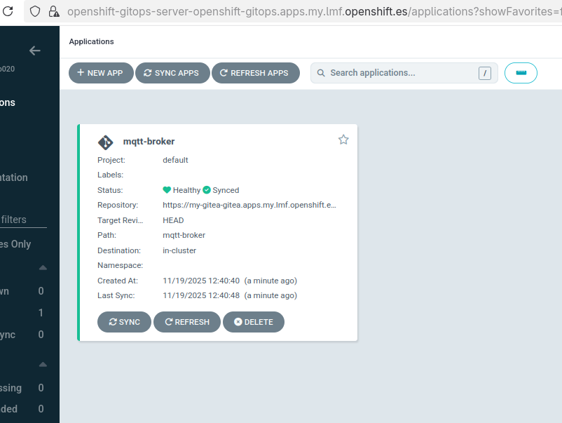
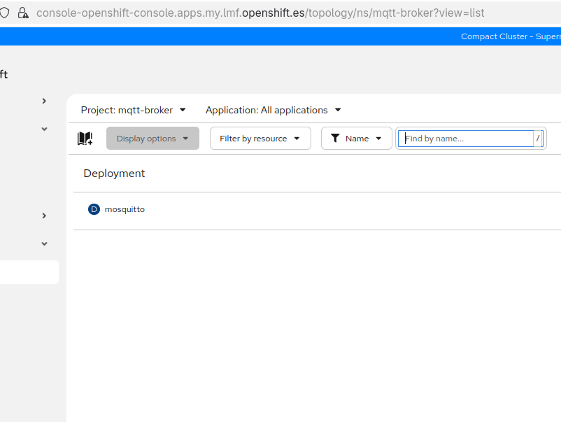
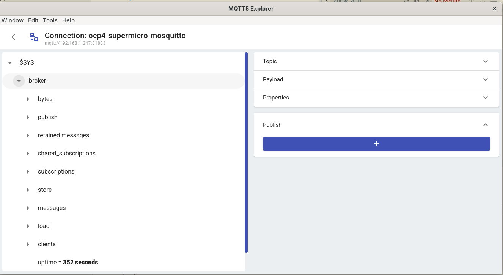

# sps-2025
This repository contains setup information/automation for the Red Hat demos for SPS 2025. It is provided "as-is", for educational and informative reasons only.

## Demo Architecture

## Setup
The setup for this demo is broken up into several parts:
0. Basic setup
1. Setup bootstrap
2. Setup the ACP
3. Setup the NVIDIA Jetson

### Basic setup
A basic x86 Linux-ish system with sufficient disk space and podman should be able to handle the setup of the demos. You will also need a flash drive, or method to mount installation ISOs to devices.

### Setting basic variables
Create a copy of the `build-args.txt.example` file, and populate it with your information:
```
# RSHM args
RHSM_ORG=123456789
RHSM_AK=ak-whatever

# IPC4 Args
INTERNAL_INTERFACE=enp2s0
EXTERNAL_INTERFACE=enp0s31f6

# IPC4 app args
GITEA_ADMIN_PASSWORD=your-password-here

# OCP install args
# Note: Don't single-quote your pull secret
PULL_SECRET=your-pull-secret
ACP_INSTALL_DEVICE=/dev/sda
ACP_INTERFACE_NAME=enp3s0
ACP_INTERFACE_MAC_ADDRESS=11:22:33:44:55:66
COREOS_SSH_KEY=ssh-ed25519 blahblahblah you@your-computer
```

### Setup IPC4
Assuming your values are correct in your args file, all that needs to be done is to build the IPC4 image and install the device - all other steps are handled through containers on Microshift.

To build the image, run:
```bash
 podman build images/ipc4/ --tag localhost/ipc4:latest --build-arg-file=build-args.txt
```

To create an installation ISO, a script is available in the [scripts](scripts/) directory, which takes 4 arguments:
1. The image to add to the ISO
2. A path to a kickstart file
3. A path to a RHEL boot ISO
4. Where to output the created ISO

An example kickstart file is available in the [kickstarts](kickstarts/) directory.

*You would need to install `skopeo` and `mkksiso` to run the script*  
*Make sure to select the drive in the kickstart which is smaller, since the other one is going to be used to mirror OCP4 images*  

Example script run:
```bash
scripts/create-iso.sh localhost/ipc4:latest  $(pwd)/kickstarts/home-testing.ks ~/Downloads/rhel-9.6-x86_64-boot.iso $(pwd)/test.iso
```

Mount the ISO to the device using your preferred method (probably USB drive), boot from it, and wait a few moments for the install to complete.

To see progress during the installation, switch to one of the other panes using `alt` + `ctrl` +`F2`, and run:
```bash
tail -f /tmp/anaconda.log
```

Once the device reboots, everything should start up on its own.

To get the microshift kubeconfig, log in as your created user and run:
```bash
get-microshift-kubeconfig.sh
```

*If you installed something on the other disk on IPC4, make sure to wipe it, so that the LVM of Microshift can use that with something like `fdisk`*  

This will place the kubeconfig into the default path, so future `oc` commands will work without needing to specify a kubeconfig.

All services are ready when all pods reach `Running` or `Completed`:
```
oc get pods -A
NAMESPACE                              NAME                                                              READY   STATUS      RESTARTS      AGE
dhcp                                   dhcp                                                              1/1     Running     0             31m
dns                                    dns                                                               1/1     Running     0             31m
gitea-operator                         603b4118f8198b060bdc8e06ec74d38a6422d65b43d1fc6195be91491a29lrl   0/1     Completed   0             30m
gitea-operator                         gitea-operator-controller-manager-7fcc5585f5-dhwkn                2/2     Running     0             30m
gitea-operator                         redhat-rhpds-gitea-jjrhw                                          1/1     Running     0             31m
gitea                                  code-694b97bbf5-xk848                                             1/1     Running     0             28m
gitea                                  deploy-gitea-8fs9l                                                0/1     Completed   0             31m
gitea                                  postgresql-code-c45c7d5cc-nwbwr                                   1/1     Running     0             29m
gitea                                  setup-gitea-admin-s2tx4                                           0/1     Completed   0             31m
kube-system                            csi-snapshot-controller-5d77bbb59c-h2swq                          1/1     Running     0             32m
oc-mirror                              registry                                                          1/1     Running     0             31m
oc-mirror                              run-oc-mirror-p2zzv                                               1/1     Running     3 (10m ago)   31m
ocp-agent-install                      install-iso                                                       1/1     Running     0             31m
openshift-dns                          dns-default-7jt67                                                 2/2     Running     0             31m
openshift-dns                          node-resolver-x25vn                                               1/1     Running     0             32m
openshift-ingress                      router-default-7567c7c4df-s2tvt                                   1/1     Running     0             32m
openshift-operator-lifecycle-manager   catalog-operator-7b75665d5b-qf5pl                                 1/1     Running     0             32m
openshift-operator-lifecycle-manager   olm-operator-6d4dd7cd64-x2894                                     1/1     Running     0             32m
openshift-ovn-kubernetes               ovnkube-master-fz5t4                                              4/4     Running     1 (31m ago)   32m
openshift-ovn-kubernetes               ovnkube-node-jxgkq                                                1/1     Running     1 (31m ago)   32m
openshift-service-ca                   service-ca-5b4769d488-jntnk                                       1/1     Running     0             32m
openshift-storage                      lvms-operator-86566ddc69-x9w2l                                    1/1     Running     0             32m
openshift-storage                      vg-manager-nlrqd                                                  1/1     Running     0             31m
```

At this point, connect your computer to the internal demo network - you should get an address in the `192.168.100.0/24` subnet, and have internet access.

### Setup the ACP
The ACP setup is an agent-based install using a local mirror registry located on IPC4. A job on IPC4 will generate the installation ISO for you, all you need to do is download it, mount it to the target installation device, and boot from it. The install should happen automatically from there.

To download the installation ISO, grab it from IPC4:
```bash
wget --no-check-certificate https://serve-iso-ocp-agent-install.apps.ipc4.sps2025.com/agent.x86_64.iso
```

Mount this media to the target installation device (USB drive, etc), and boot from it. The cluster installation should begin and complete automatically.

The cluster kubeconfig and kubeadmin-password files are also available on IPC4:
```
wget --no-check-certificate https://serve-iso-ocp-agent-install.apps.ipc4.sps2025.com/auth/kubeconfig
wget --no-check-certificate https://serve-iso-ocp-agent-install.apps.ipc4.sps2025.com/auth/kubeadmin-password
```

To watch the installation process, two methods are useful:
1. SSH into the CoreOS node and run `sudo journalctl -f`
2. Watch the operators come up: `watch -d "oc get co"`

The cluster has baked-in manifests that will be deployed during the install - these should bootstrap GitOps, and link back to Gitea on IPC4.

You can easily access the cluster from IPC3 (copying over `kubeconfig` file) while leaving IPC4 for local `microshift` access.  

### Setup Nvidia Jetson

## Workloads

### GitOps prep

Gitea and GitOps are preinstalled, but we will add the steps here in case you want to reproduce the gitops style deployment somewhere else.

First install Red Hat GitOps Operator, this will automatically deploy an ArgoCD instance, accessible from inside the cluster and with the local cluster already imported. You can login using the OpenShift integrated OAuth.

Then you would need to install Gitea. There is Red Hat maintained operator [here](https://github.com/rhpds/gitea-operator).  

You can create the operator by simply applying the YAML files from the Github repository

`$ oc apply -k https://github.com/rhpds/gitea-operator/OLMDeploy`

This installs the operator cluster wide - which means you (or your users) can create instances of Gitea in any project on the cluster.

Create a new project for your Gitea instance:

` $ oc new-project gitea`

The Gitea Operator can set up a PostgreSQL database alongside the Gitea Pod. This is the default deployment.

If an Admin User ID is specified you can specify a password for the admin user as well. If no password is specified a password is generated with a certain length. The length of the generated password can be set via the password length variable.  
The operator will report the status of the admin user creation as well as the user password in the fields `.status.adminSetupComplete: true` and `.status.adminPassword`.  
To deploy a simple Gitea instance:

```yaml
apiVersion: pfe.rhpds.com/v1
kind: Gitea
metadata:
  name: my-gitea
  namespace: gitea
spec:
  giteaAdminEmail: admin@example.com
  giteaAdminPassword: ''
  giteaAdminPasswordLength: 12
  giteaAdminUser: admin
  giteaSsl: true
  giteaVolumeSize: 4Gi
  postgresqlVolumeSize: 4Gi```
```

You can now create a repo on Gitea and sync that to ArgoCD.  

In case Gitea certificate is self signed you can use the following option in git:  

` -c http.sslVerify=false `

In case you want to deploy applications across different spoke / managed clusters beside the local one you can follow this [tutorial](https://developers.redhat.com/articles/2025/06/24/how-automate-multi-cluster-deployments-using-argo-cd?source=sso).  

   

  

  

We can now create helm charts and / or kustomize files to sync Applications to managed clusters.  
The basic ACP services have already been deployed and the source can be found [here](https://github.com/RedHatEdge/acp-standard-services-public/tree/dev)  

### Nvidia GPU device

#### Defect recognition application

### ACP

#### MES Critical Manufacturing

#### MQTT Broker

We will be using Mosquitto as MQTT Broker, you can find the related manifests in the [folder](workloads/mqtt-broker/)
These can be pushed to our Gitea repo and synced as ArgoCD Application.

> NOTE: Make sure that ArgoCD can manage deployment over other [namespaces](https://access.redhat.com/solutions/7007638) and clusters first.  





  

You can now access the broker using a client like [MQTT5 Explorer](https://github.com/Omniaevo/mqtt5-explorer). You would require with the current configuration a valid username / password `admin:password`  



#### OPCUA Manufacturing Server (simulated process)

Based on [this](https://github.com/lucamaf/edge-manufacturing-server?tab=readme-ov-file) we will be deploying a NOdeRED based OPCUA server, which simulates a process with multiple sensors.

#### OPCUA / MQTT gateway (Takebishi)

#### Defect recognition application (simulated process)

This will run on ACP and will be simulating the defects recognition machine learning app (that should be running on Nvidia GPU). Based on random function it will be providing an output on a **MQTT Broker** topic following this [source](https://medium.com/@API4AI/mes-integration-real-time-defect-feeds-to-erp-a54c9243bdfc):  

```json
{
  "defect_type": 1,
  "defective": true,
  "confidence_score": 0.05,
  "timestamp": "2024-11-20T15:30:00Z",
  "line_id": 24,
  "station_id": 10,
  "batch_id": "X345678",
  "id": 12001
}
```

You can find the relative manifests in the [folder](workloads/defect-rec-sim/)


#### HMI open source connected to MQTT Broker


#### Dell iDrac Service Module

Installed the ISM container on ACP to provide more detailed information about the server and running OS to iDrac.

How to:

- pushing a built image to mirror registry on IPC4 on Microshift
- build the image and push it to a public repo (like Quay.io)
- add it to the oc-mirror/configmap.yaml file
- apply the new configuration: `$ oc -n oc-mirror apply -f /etc/microshift/manifests.d/oc-mirror/configmap.yaml`
- rerun the import images job by creating and applying a copy of `/etc/microshift/manifests.d/oc-mirror/job.yaml`:

```bash
$ oc -n oc-mirror get job run-oc-mirror -o json | \
jq -r '.metadata.annotations."kubectl.kubernetes.io/last-applied-configuration"' | \
oc -n oc-mirror replace --save-config --force -f -
```

#### Windows 11 VM on OCP-V - Codesys IDE

Download WIN11 iso on IPC4
curl "https://software.download.prss.microsoft.com/dbazure/Win11_25H2_EnglishInternational_x64.iso?t=7129ee82-c634-44f0-9c52-4ed124f901a0&P1=1762599991&P2=601&P3=2&P4=FSo6iBj9ZQroci78wN7HIc8amPneeoGTgvPzkZSqmHMDacqYQw0u1drkD%2f%2bUfI7N8VoVpv3KEUbrkfQDTyxWe73dlR3OnATkrXNQShTGMZY8bdQAa5rjLnAXDs8XBQ2i%2fc9BrNghPBKHddps0us5NzPMlzy%2b%2bowTLfhU0BJTaWT2ZXs5cewxY9E4uPh51bdRnb2DCsZiTmWxA8QkjbV7s0%2byVVFBl%2f8GWfzASMoFuSG%2f%2bQZ0LjVv%2bPtUhR9oQbnJeScCzLDPopzSiCduMiQoxf8NhGDp6VA%2f%2fwg3p7IW50eJa9890ud1IDZOLoMMCh4sPynK63DKtyrQmccgviuUTg%3d%3d" -o win11_x64.iso
https://github.com/kubevirt/kubevirt-tekton-tasks/tree/main/templates-pipelines/windows-efi-installer  
Install OpenShift Pipelines TODO add it to the Gitops in Gitea  
Create a new project (for example codesys)  
Create the configmap that contains the unattended.xml file: https://raw.githubusercontent.com/kubevirt/kubevirt-tekton-tasks/refs/heads/main/release/pipelines/windows-efi-installer/configmaps/windows-efi-installer-configmaps.yaml oc --kubeconfig kubeconfig -n codesys create -f WIN11/windows-efi-installer-configmaps.yaml  
Run the pipeline that download, imports, create golden image of win11 (using unattended configuration): oc --kubeconfig kubeconfig create -f WIN11/pipelineruns.yaml  
Before getting to the WIN11 installation wizard, make sure to assing a `e1000` network driver to the VMI, Windows doesn't like `virtio` card much at first installation. After that, make sure to make the switch, since `virtio` network card is much more performant (install the local virtio-win drivers).  
In case you cannot connect, make sure to check this blog entry to terminate installation offline: https://medium.com/@zorozeri/windows-11-arm-having-no-network-connection-on-vmware-fusion-pro-5b06e894811e  

## Todo on restart
remmeber to change the /etc/microshift/manifests.d/dns/configmap.yaml with the correct local nameservers assigned by the public WAN, connected to IPC4

## Access to systems for SPS 2025  

Please check the repo [here](https://github.com/lucamaf/sps-2025-systems)

