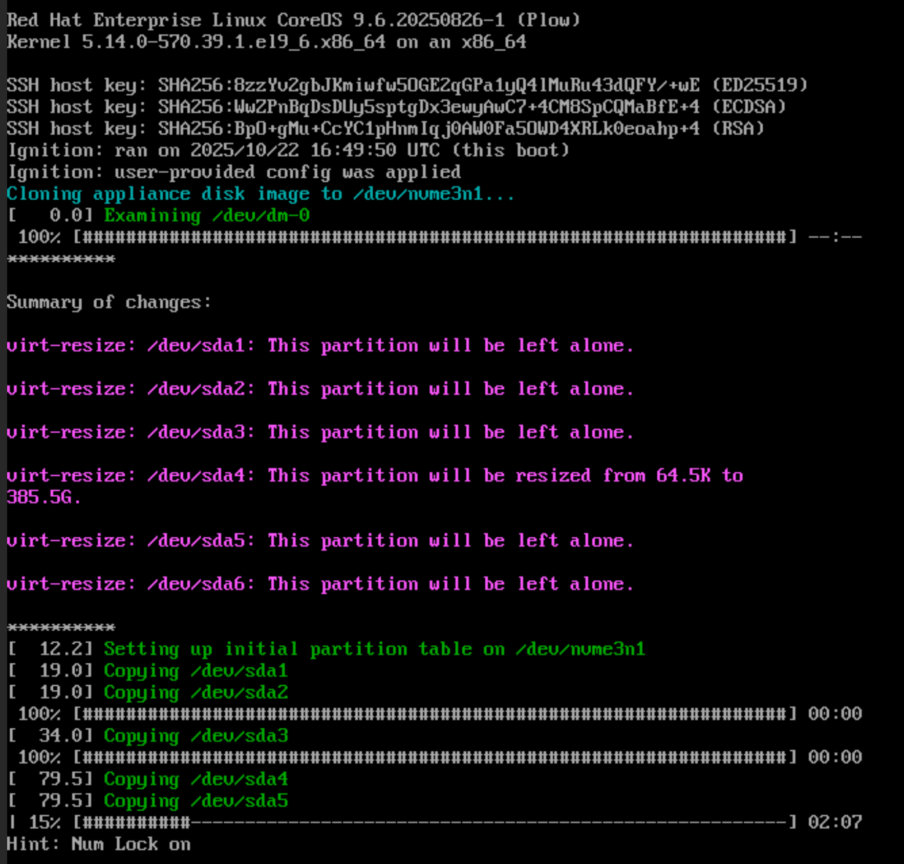
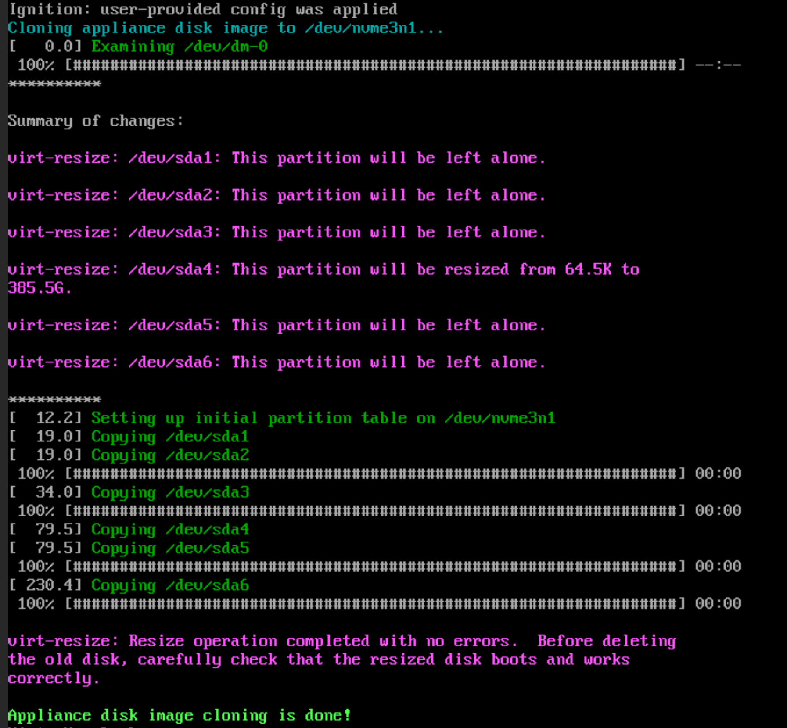
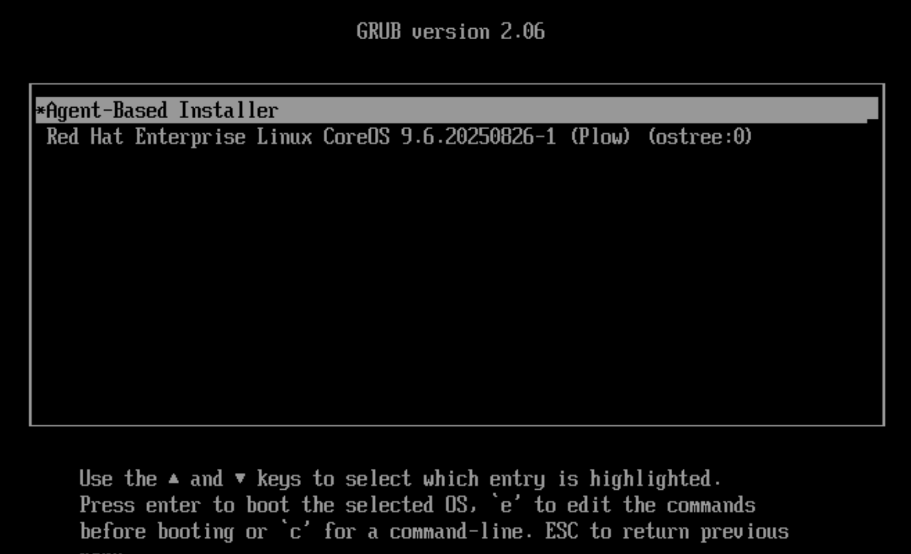

# sps-2025
This repository contains setup information/automation for the Red Hat demos for SPS 2025. It is provided "as-is", for educational and informative reasons only.

## Demo Architecture

## Setup
The setup for this demo is broken up into several parts:
0. Basic setup
1. Setup bootstrap
2. Setup the ACP
3. Setup the NVIDIA Jetson

### Basic setup
A basic x86 Linux-ish system with sufficient disk space (~250GB) available should be able to handle the setup of the demos.

Most of the following automation is written in Ansible in an attempt to make the things easy to get going. To prepare a system to run this automation, a virtual environment should be set up, and ansible-navigator installed. Then, a few basic variables need to be supplied.

#### Setting up an virtual environment
Use the following to setup a virtual environment where ansible-navigator can run:
```bash
git clone https://github.com/RedHatEdge/sps-2025.git
cd sps-2025
python -m venv .venv
source .venv/bin/activate
pip install --upgrade pip
pip install ansible-navigator
```

Any relatively current version of ansible-navigator should do, however this was specifically written/tested on `ansible-navigator 25.9.0`.

> Note:
>
> ansible-navigator requires a container engine, preferrably podman.

#### Setting basic variables
Two main files must be created to feed into the playbooks: an inventory (`inventory.yaml`) file and an extra-vars (`extra-vars.yaml`) file.

If you're familiar with Ansible, feel free to setup your own files, however the following examples will get you close:

```yaml
--- # inventory.yaml
---
all:
  hosts:
    helper:
      ansible_host: 1.2.3.4
      ansible_user: your-username
      ansible_become_password: 'your-password'
```

> Note:
>
> Do NOT use `root` for the `ansible_user` - instead, use a user that can sudo. If you use `root`, the playbooks will fail.

```yaml # extra-vars.yaml
---
pull_secret: 'your-pull-secret'
ssh_key: 'ssh-ed25519 whateverkey1234 you@your-laptop'
core_user_password: 'a-good-password-here'

openshift_install_settings:
  device: /dev/sda
  cluster_name: cluster
  base_domain: your-url.com
  machine_network: 192.168.1.0/24 # Ensure your node is in this subnet
  network_config:
    interfaces:
      - name: eno1
        mac_address: c8:4b:d6:ab:bd:91
        ip_address: 192.168.1.10
        prefix_length: 24
    dns_servers:
      - 192.168.1.1
    routes:
      - destination: 0.0.0.0/0
        next_hop_address: 192.168.1.1
        next_hop_interface: eno1
        table_id: 254
```

Once these files are created, installation can proceed.

### Setup Bootstrap

### Setup the ACP
The ACP setup is based on the [OpenShift Appliance](https://access.redhat.com/articles/7065136), which puts installation and additional content onto disk before the cluster install, allowing for disconnected (or limited connected) installs.

There are two main pieces to the installation: the appliance image, and the agentconfig.

First, create the appliance image:
```
ansible-navigator run playbooks/000-create-appliance-image.yaml --inventory inventory.yaml --extra-vars @extra-vars.yaml --execution-environment-image quay.io/jswanson/sps-ee:2025 --mode stdout -vv
```

Expect this to take ~15-20 minutes on a gigabit connection.

Next, create the agentconfig:
```
ansible-navigator run playbooks/000-create-agent-config.yaml --inventory inventory.yaml --extra-vars @extra-vars.yaml --execution-environment-image quay.io/jswanson/sps-ee:2025 --mode stdout -vv
```

First, mount the appliance ISO to the target installation host, and boot from it. The iso will boot into CoreOS and begin copying content to specified installation device:


Once complete, the device can be shut down:


Now, mount the agentconfig ISO to the device, and boot **from the device where the appliance was deployed**, selecting `Agent-Based Installer`:


The appliance will boot, scan for the agentconfig, and perform a cluster install:

> Note:
>
> It may take a few moments for the appliance to find the agentconfig and read it in - be patient.