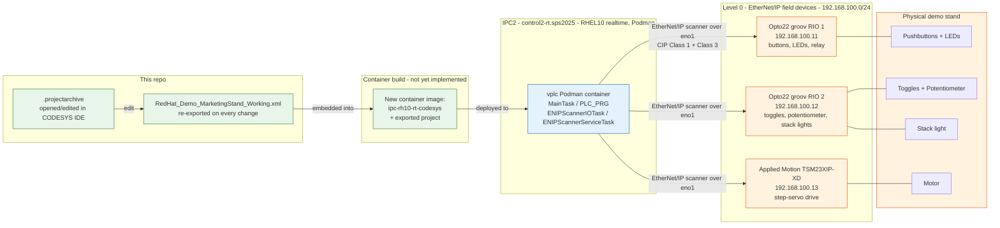
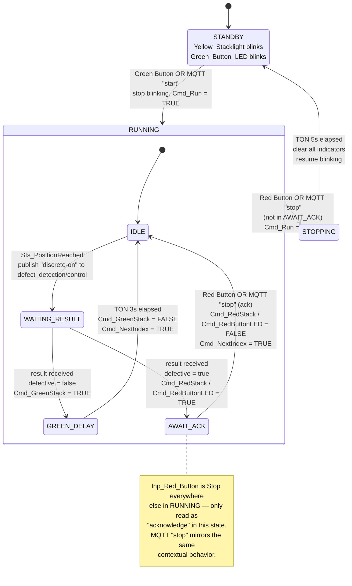

# CODESYS workflow — Marketing Demo Stand

This doc focuses on **Purdue Model Level 0 (physical process) and Level 1 (basic control)** for the marketing demo stand: the field devices themselves, the CODESYS logic that controls them, and how a logic change gets deployed to the vPLC running on IPC2. It does not cover the platform/GitOps layers (IPC4 build, Gitea, ArgoCD, SNO) — see [HOW_IT_WORKS.md](../../HOW_IT_WORKS.md) for that.

## 1) What's in this folder

- **`RedHat_Demo_MarketingStand_Working.xml`** — a plain-text CODESYS project export (`Project → Export`). This is the git-friendly artifact: diffable, reviewable, small enough to track normally. It contains the full device tree, task configuration, POUs, and global variables, but not compiled binaries or referenced libraries.
- **`09_19_426pmRedHat_Demo_MarketingStand_Working.projectarchive`** — the full CODESYS project archive (`.projectarchive`), including referenced libraries and everything needed to reopen and rebuild the project as-is in the IDE. Large binary file — tracked via **Git LFS** (see the main [README.md](../../README.md#codesys-ide-win11-on-ocp-v), step 12).

Treat the `.xml` as the reviewable record of what the logic does; treat the `.projectarchive` as the thing you actually open in CODESYS IDE to keep working on it.

## 2) Level 0 — the physical process

Level 0 of the Purdue Model is the physical process itself: the sensors and actuators that do the actual work, with no logic of their own. On this demo stand that's pushbuttons, indicator LEDs, toggle switches, a potentiometer, a three-color stack light, a relay, and a small motor — wired to three EtherNet/IP field devices on the `192.168.100.0/24` network:

| Device | Role | Address | I/O it exposes |
|---|---|---|---|
| `Opto22_RIO1` — [groov RIO](https://www.opto22.com/products/groov-rio) | Universal edge I/O | `192.168.100.11` | `Red_Button`, `Green_Button`, `Blue_Button` (digital in) → `Red_Button_LED`, `Green_Button_LED`, `Blue_Button_LED` (digital out); `Relay_In`, `Relay_Out` |
| `Opto22_RIO2` — [groov RIO](https://www.opto22.com/products/groov-rio) | Universal edge I/O | `192.168.100.12` | `Toggle_1`, `Toggle_2` (digital in), `Potentiometer` (analog in) → `Red_Stacklight`, `Yellow_Stacklight`, `Green_Stacklight` (digital out) |
| `TSM23XIP_XD` — Applied Motion [TSM23 integrated step-servo](https://www.applied-motion.com/products/series/ethernet-ip-products) | Motion / actuation | `192.168.100.13` | Demo motor motion commands + status, over CIP explicit and implicit (I/O) messaging |

**groov RIO** (Opto 22): a rack-free, PoE-powered edge I/O module. Each unit here provides 8 software-configurable channels (any mix of digital/analog in or out) plus 2 electromechanical relays, an onboard I/O processor, and — beyond the EtherNet/IP CIP adapter mode used by this project — native support for MQTT/Sparkplug, OPC UA, Modbus/TCP and REST, none of which this demo currently uses. Reference: [ETH-IP-IO-Module](../ETH-IP-IO-Module/) in this repo (`groovFind.exe` for discovery, the groov RIO user's guide), and Opto 22's own [groov RIO data sheet](https://documents.opto22.com/2317_groov_RIO_Data_Sheet.pdf).

**TSM23XIP-XD** (Applied Motion Products): a NEMA 23 integrated closed-loop step-servo — motor, drive electronics, and an EtherNet/IP interface combined into one unit, powered at 24–48VDC. It exposes over 100 commands and 130 registers over EtherNet/IP for motion control, I/O, and configuration. Reference: [ETH-IP-StepServoDrive](../ETH-IP-StepServoDrive/) in this repo (hardware manual, EDS file, step-servo tuner utility), and Applied Motion's [EtherNet/IP product line](https://www.applied-motion.com/products/series/ethernet-ip-products).

All three are **EtherNet/IP CIP adapters** (targets): they accept the Class 1 (implicit, cyclic I/O) connection from a scanner and expose input/output assemblies, and also answer Class 3 (explicit) service requests. They never initiate traffic themselves — that's the scanner's job, which is where Level 1 comes in.

## 3) Level 1 — basic control (the vPLC)

Level 1 is the controller that closes the loop on Level 0: it scans inputs, runs logic, and drives outputs. Here that's a **CODESYS soft-PLC runtime (vPLC) running as a Podman container on IPC2** (hostname `control2-rt.sps2025`, a bootc image built from `quay.io/luferrar/sps:ipc-rh10-rt` — RHEL10 with a realtime kernel; see `images/ipc2/ContainerfileCodesys`). The runtime is [CODESYS Virtual Control SL](https://www.codesys.com/products/runtime/virtual-control-sl/), CODESYS's runtime built specifically to run under a container or hypervisor rather than bare metal. §4 covers how it's deployed manually today; §5 covers the target build/push/deploy workflow for shipping application changes as a new container image.

IPC2 has **two network roles** split across separate interfaces:

- **`eno1`, `192.168.100.225/24`** — dedicated to the vPLC container for EtherNet/IP CIP traffic, mapped in via the instance's `Nic` setting. This is on the same `192.168.100.0/24` segment as `Opto22_RIO1`, `Opto22_RIO2`, and `TSM23XIP_XD`.
- **`192.168.100.227`** — IPC2's management address, used for the CODESYS Gateway connection from the IDE (port `11740`, opened through the firewall for remote management) and for CodeMeter license-server discovery.

The container also exposes `4840` (OPC UA server) and `8080` (WebVisu/HTTP) alongside `11740`. Licensing runs through CodeMeter (WIBU-SYSTEMS) — the container's instance config points its `License Server` setting at `192.168.100.223`; the host itself also runs `codemeter.service` (installed via `images/ipc2/CodeMeter-lite-8.40.7131-502.x86_64.rpm`, see `images/ipc2/ContainerfileCodesys`).

Inside the `Device` → `Application`, the project structure is:

- **`PLC_PRG`** — the main program, cyclically scheduled by **`MainTask`**. It reads the Level 0 inputs (buttons, toggles, potentiometer), runs the demo logic, and writes the Level 0 outputs (LEDs, stack lights, motor commands).
- **`FUNC_SCALE`** — scales the raw `Potentiometer` analog reading into an engineering-range value used elsewhere in the logic.
- **`LIGHT_CYCLE`** — drives the red/yellow/green stack-light sequencing.
- **`MOTOR`** — issues motion commands to the `TSM23XIP_XD` servo drive.
- **`GVL`** — the global variable list binding these POUs to the actual I/O channel names shown in the table above.

The EtherNet/IP side of Level 1 is handled by the `Ethernet` → `EtherNet_IP_Scanner` device, which acts as the CIP **scanner** (connection originator) for all three Level 0 adapters, and by two dedicated tasks:

- **`ENIPScannerIOTask`** — the cyclic Class 1 I/O scan: pulls current input assemblies from `Opto22_RIO1`/`Opto22_RIO2`/`TSM23XIP_XD` and pushes current output assemblies to them, on every scan.
- **`ENIPScannerServiceTask`** — Class 3 explicit/service messaging (e.g. one-off parameter reads/writes, diagnostics) to the same three devices.

This is what actually reaches the field devices over `eno1`, as described above.

## 4) Manual deployment of the Codesys Application to softPLC

Deploy Control SL (softPLC) to the Device (this will download the softPLC container image to the Device)


Connect to the new Device (via SSH)


Install Virtual Control to the Device (import image to Podman)
 

Installed!

```bash
[admin@control2-rt ~]$ sudo podman images
REPOSITORY                                     TAG                  IMAGE ID      CREATED       SIZE
quay.io/luferrar/sps                           ipc-rh10-rt-codesys  aa41f53b572c  11 hours ago  3.84 GB
quay.io/luferrar/sps                           ipc-rh10-rt          f85ac7a8d20f  16 hours ago  3.65 GB
docker.io/library/codesyscontrol_virtuallinux  4.21.0.0             a6590499224a  8 weeks ago   152 MB
```

Add a new instance of Virtual Control (configuration of a container)


New VPLC container


Configure exposed / mapped ports

>Notice how License server address is configured (if you have a valid license there) and Network section is filled in with an interface information (in this case eno1 has to be dedicated since we are using Eth/IP as protocol)  
> **REFERENCE** for configuration [here](https://content.helpme-codesys.com/en/CODESYS%20Control/_rtsl_reference.html) 

Start the instance


Opening target Device properties
  

Adding new Device (IPC2)  
*Use the other available interface to connect to the IPC*


Have to open firewall port 11740 for remote management


Connected!


Before uploading the application, make sure the IP addresses for Ethernet/IP components are correct
  
  
  


Deploy the application to VPLC


User management for VPLC (using password `R3dh4t123!`)


Upload the application to VPLC


Start the application on VPLC


Codemeter Licensing


## 5) Target workflow: build → push → deploy (not yet implemented)

§4 above is how the application is deployed **today**: manually, through the CODESYS IDE's device wizard, onto a long-lived `vplc` Podman container running the stock `codesyscontrol_virtuallinux` image on IPC2. The intended target workflow instead bakes the application *into* the container image itself, so a logic change ships as a new image rather than an IDE upload:

1. An engineer edits the logic in CODESYS IDE, opening the `.projectarchive` from this folder, and re-exports the project to `RedHat_Demo_MarketingStand_Working.xml` (re-saving the `.projectarchive` too) — both get committed back to this repo, so the demo logic stays version-controlled.
2. A new container image is built on top of `images/ipc2/ContainerfileCodesys` (which already produces `quay.io/luferrar/sps:ipc-rh10-rt-codesys`, RHEL10 + the CodeMeter RPM), adding a layer that embeds the exported project into the CODESYS Virtual Control SL runtime. (This build step itself — how the project gets baked in — is not yet implemented.)
3. The new image is pushed to the registry and deployed to run as the `vplc` **Podman** container on **IPC2** (`control2-rt.sps2025`), replacing the manual "Deploy Control SL" + "Upload the application" steps in §4.
4. On start, the containerized vPLC loads the project, `MainTask`/`PLC_PRG` begins cycling, and the EtherNet/IP scanner opens Class 1 connections to `Opto22_RIO1`, `Opto22_RIO2`, and `TSM23XIP_XD` over the dedicated `eno1`/`192.168.100.225` interface.
5. Level 1 now closes the loop on Level 0 continuously: button/toggle/potentiometer state in, LED/stack-light/servo-motion commands out.

## Diagram (§5 target workflow)



## 6) Defect-check workflow (implemented)

The MQTT-gated defect-check design from earlier revisions of this doc has been built and is running on the `vplc` instance. Core control flow (Standby↔Running↔Stopping, MQTT trigger/result round-trip, defect ack) has been validated end-to-end via live testing; **physical motion is not yet confirmed** — see "Known open issues" below. This section documents what's actually deployed, corrected for everything that turned out different from the original plan during implementation.

### Architecture

Two new POUs, plus one new named type, plus targeted patches to `PLC_PRG` and `LIGHT_CYCLE`:

- **`E_DefectState`** (DUT, named enum) — `(IDLE, WAITING_RESULT, GREEN_DELAY, AWAIT_ACK)`. Has to be a separately-named `TYPE`, not inline/anonymous — CODESYS scopes anonymous enum literals to their declaring POU only, so `DEFECT_CHECK`'s own `state` field wouldn't have been referenceable from `SEQ_SUPERVISOR` otherwise.
- **`DEFECT_CHECK`** (FB) — the per-cycle defect-check state machine: publishes the analysis trigger, waits for the result, drives the green-delay-and-continue or red-hold-for-ack outcome.
- **`SEQ_SUPERVISOR`** (PRG) — the top-level Standby/Running/Stopping supervisor. Owns the MQTT client connection, the Standby blink, the remote start/stop listener, and one `DEFECT_CHECK` instance. Wired into `MainTask` alongside `MOTOR`/`PLC_PRG`/`LIGHT_CYCLE`.

```iecst
TYPE E_DefectState :
(
    IDLE,
    WAITING_RESULT,
    GREEN_DELAY,
    AWAIT_ACK
);
END_TYPE
```

```iecst
FUNCTION_BLOCK DEFECT_CHECK
VAR_INPUT
    state       : E_DefectState := E_DefectState.IDLE;
    xRemoteStop : BOOL;
END_VAR
VAR_IN_OUT
    mqttClient : MQTT.MQTTClient;
END_VAR
VAR
    mqttPublisher  : MQTT.MQTTPublish;
    mqttSubscriber : MQTT.MQTTSubscribe;
    tonGreenDelay  : TON;
    trigPublish    : R_TRIG;
    xArmPublish    : BOOL;
    sPublishMsg    : STRING(20) := 'discrete-on';
    wsControlTopic : WSTRING(1024) := "defect_detection/control";
    wsResultFilter : WSTRING(1024) := "defect_detection/results";
    sResultBuffer  : STRING(255);
    defective      : BOOL;
END_VAR

mqttSubscriber(
    xEnable           := mqttClient.xConnectedToBroker,
    eSubscribeQoS     := MQTT.MQTT_QOS.QOS0,
    pbPayload         := ADR(sResultBuffer),
    udiMaxPayloadSize := SIZEOF(sResultBuffer),
    mqttClient        := mqttClient,
    wsTopicFilter     := wsResultFilter
);

trigPublish(CLK := xArmPublish);
mqttPublisher(
    xExecute       := trigPublish.Q,
    pbPayload      := ADR(sPublishMsg),
    udiPayloadSize := DINT_TO_UDINT(LEN(sPublishMsg)),
    mqttClient     := mqttClient,
    wsTopicName    := wsControlTopic
);
xArmPublish := FALSE;

CASE state OF
    E_DefectState.IDLE:
        IF GVL.Sts_PositionReached THEN
            xArmPublish := TRUE;
            state := E_DefectState.WAITING_RESULT;
        END_IF

    E_DefectState.WAITING_RESULT:
        IF mqttSubscriber.xReceived THEN
            defective := FIND(sResultBuffer, '"defective":true') > 0;
            IF defective THEN
                GVL.Cmd_RedStack     := TRUE;
                GVL.Cmd_RedButtonLED := TRUE;
                state := E_DefectState.AWAIT_ACK;
            ELSE
                GVL.Cmd_GreenStack := TRUE;
                tonGreenDelay(IN := TRUE, PT := T#3S);
                state := E_DefectState.GREEN_DELAY;
            END_IF
        END_IF

    E_DefectState.GREEN_DELAY:
        tonGreenDelay(IN := TRUE, PT := T#3S);
        IF tonGreenDelay.Q THEN
            GVL.Cmd_GreenStack := FALSE;
            tonGreenDelay(IN := FALSE);
            GVL.Cmd_NextIndex := TRUE;
            state := E_DefectState.IDLE;
        END_IF

    E_DefectState.AWAIT_ACK:
        IF NOT Inp_Red_Button.State OR xRemoteStop THEN
            GVL.Cmd_RedStack     := FALSE;
            GVL.Cmd_RedButtonLED := FALSE;
            GVL.Cmd_NextIndex    := TRUE;
            state := E_DefectState.IDLE;
        END_IF
END_CASE
```

```iecst
PROGRAM SEQ_SUPERVISOR
VAR
    machineState    : (STANDBY, RUNNING, STOPPING) := STANDBY;
    mqttClient      : MQTT.MQTTClient;
    defectCheck     : DEFECT_CHECK;
    tonBlinkOn      : TON;
    tonBlinkOff     : TON;
    blinkOut        : BOOL;
    tonStopRecovery : TON;

    remoteControlSub     : MQTT.MQTTSubscribe;
    wsRemoteControlTopic : WSTRING(1024) := "plc_application/control";
    sRemoteControlBuffer : STRING(255);
    xRemoteStart          : BOOL;
    xRemoteStop            : BOOL;
END_VAR

// MQTT connection maintained continuously, independent of machineState
mqttClient(
    xEnable            := TRUE,
    sHostname          := '192.168.100.245',
    uiPort             := 1883,
    xUseTLS            := FALSE,
    xCleanSession      := TRUE,
    wsUsername         := "admin",
    wsPassword         := "password",
    eCommunicationMode := MQTT.COMMUNICATION_MODE.TCP,
    eMQTTVersion       := MQTT.MQTT_VERSION.V3_1_1
);

// remote start/stop listener — one topic, distinguished by payload
remoteControlSub(
    xEnable           := mqttClient.xConnectedToBroker,
    eSubscribeQoS     := MQTT.MQTT_QOS.QOS0,
    pbPayload         := ADR(sRemoteControlBuffer),
    udiMaxPayloadSize := SIZEOF(sRemoteControlBuffer),
    mqttClient        := mqttClient,
    wsTopicFilter     := wsRemoteControlTopic
);
xRemoteStart := remoteControlSub.xReceived AND FIND(sRemoteControlBuffer, 'start') > 0;
xRemoteStop  := remoteControlSub.xReceived AND FIND(sRemoteControlBuffer, 'stop') > 0;

CASE machineState OF
    STANDBY:
        tonBlinkOn(IN := NOT blinkOut, PT := T#500MS);
        tonBlinkOff(IN := blinkOut, PT := T#500MS);
        IF tonBlinkOn.Q THEN
            blinkOut := TRUE;
        END_IF
        IF tonBlinkOff.Q THEN
            blinkOut := FALSE;
        END_IF
        GVL.Cmd_YellowStackBlink    := blinkOut;
        GVL.Cmd_GreenButtonLEDBlink := blinkOut;

        IF Inp_Green_Button.State OR xRemoteStart THEN
            tonBlinkOn(IN := FALSE);
            tonBlinkOff(IN := FALSE);
            GVL.Cmd_YellowStackBlink    := FALSE;
            GVL.Cmd_GreenButtonLEDBlink := FALSE;
            defectCheck.state := E_DefectState.IDLE;
            PLC_PRG.Cmd_Run := TRUE;
            machineState := RUNNING;
        END_IF

    RUNNING:
        defectCheck(mqttClient := mqttClient, xRemoteStop := xRemoteStop);
        IF (NOT Inp_Red_Button.State OR xRemoteStop) AND defectCheck.state <> E_DefectState.AWAIT_ACK THEN
            PLC_PRG.Cmd_Run := FALSE;
            tonStopRecovery(IN := TRUE, PT := T#5S);
            machineState := STOPPING;
        END_IF

    STOPPING:
        tonStopRecovery(IN := TRUE, PT := T#5S);
        IF tonStopRecovery.Q THEN
            tonStopRecovery(IN := FALSE);
            GVL.Cmd_GreenStack   := FALSE;
            GVL.Cmd_RedStack     := FALSE;
            GVL.Cmd_RedButtonLED := FALSE;
            machineState := STANDBY;
        END_IF
END_CASE
```

### MQTT: library, broker, topics

The **official CODESYS "MQTT Client SL"** library ended up being used (first-party, CODESYS Store), not the Janz Tec library originally proposed — found already referenced in an example project pulled from the CODESYS Store, and adopted since it's the vendor-native option. It depends on the **Memory Block Manager** library (`MBM` namespace) internally, which had to be added separately — its absence produces `C0086: No definition found for interface 'MBM.IDisposable'` at build time.

Broker and topics, confirmed by live testing (not all were right on the first guess — see "Implementation notes" below):

| Purpose | Topic | Payload | Notes |
|---|---|---|---|
| Broker | `192.168.100.245`, port `1883` | — | Found in `workloads/xentara/model.json`. Port/credentials (`admin`/`password`) are still an unverified assumption that happens to work. |
| Analysis trigger (publish) | `defect_detection/control` | `'discrete-on'` | Corrected twice — first guessed `discrete_active` per the [edge-defect-detector](https://github.com/lucamaf/edge-defect-detector) README's documented vocabulary (wrong), then `discrete_active` again per explicit user confirmation (also wrong), finally corrected to `discrete-on` from live testing. The README's documented control vocabulary doesn't match the actual running Jetson code. |
| Analysis result (subscribe) | `defect_detection/results` | `{"defective":bool,"confidence":real,"timestamp":string,"piece":int}` | Matches both the detector's own README and the field mapping in `workloads/xentara/model.json` — this one was right from the start. |
| Remote start/stop (subscribe) | `plc_application/control` | `'start'` / `'stop'` | One shared topic/subscription rather than a separate one per command, to avoid adding a third simultaneous `MQTTSubscribe` instance while it's still unclear whether the unlicensed library caps concurrent subscriptions. |

### `PLC_PRG` — translated from ladder to Structured Text, patched

Rewritten from the original ladder logic into ST (kept functionally identical — verified network-by-network against the real ladder in the IDE) so the defect-check patch could be applied as ordinary text edits instead of ladder-diagram surgery. `Cmd_Run` had to move from a plain `VAR` to `VAR_INPUT`, since `SEQ_SUPERVISOR` needs to write it from outside — CODESYS only allows external writes to `VAR_INPUT`/`VAR_IN_OUT`, never a plain `VAR`.

The defect-check patch itself, against the real (ST-translated) ladder networks:

- **Network 1** (safe-state/`Cmd_Stop`): removed the `NOT Inp_Red_Button.State` term specifically — kept `Sts_FirstScanBit`/`Sts_SequenceDone`/`Force_Stop`/`eState<>8`. Left in, it would force `Cmd_Stop` on every Red Button press, including during `DEFECT_CHECK`'s `AWAIT_ACK`.
- **Network 2** (Green Button → `Cmd_Run` latch): disabled entirely — `Cmd_Run` is now set externally by `SEQ_SUPERVISOR`.
- **Network 9** (wait for move done): added a new `R_TRIG` on `AMP_Relative_Move_0.Done`, driving `GVL.Sts_PositionReached` — this is the actual hook that starts the defect-check cycle.
- **Network 10** (the real loop-back — a genuine loop, not a straight-through pause as first assumed from the network comments alone): AND-gated the existing `TON_IndexPauseDelay.Q`-driven loop-back on `GVL.Cmd_NextIndex`, with a reset once consumed, so the sequencer holds at the paused step until `DEFECT_CHECK` releases it.

Full current source:

```iecst
PROGRAM PLC_PRG
VAR_INPUT
    Cmd_Run : BOOL;
END_VAR
VAR
    Cmd_Stop, Force_Run, Force_Stop : BOOL;
    Sequence_Run     : DINT;
    Sts_SequenceDone : BOOL;
    Sts_FirstScanBit : BOOL := TRUE;
    Sts_SeqTimeout   : DINT;
    Par_SingleIndex  : BOOL;
    Par_IndexPause   : TIME;
    MotorEnabled     : BOOL;

    R_TRIG_0             : R_TRIG;
    trigPositionReached  : R_TRIG;
    trigBlueButton       : R_TRIG;
    trigRelayIn          : R_TRIG;
    TON_MotorDataDelay   : ARRAY[0..3] OF TON;
    TON_IndexPauseDelay  : TON;
    TON_Timeout_Reset    : TON;
    TON_Timeout_Enable   : TON;
    TON_Timeout_Move1    : TON;
    TON_Timeout_Move2    : TON;
    TON_Timeout_Stop     : TON;

    tStart, tEnd, tDelta, newTimeDelta : TIME;
    ReturnTimeFinish : BOOL;
    MoveDelta        : BOOL;
    RealTimeDelta    : REAL;
    IndexPauseInt                 : REAL;
    IndexPauseMin, IndexPauseMax  : DINT;

    Seq0, Seq10, Seq20, Seq30, Seq40, Seq50, Seq60 : BOOL;
    SeqMov1, SeqMov2, SeqStop, SeqErr              : BOOL;
END_VAR

// ---- Network 1: safe-state / stop conditions ----
// NOT Inp_Red_Button.State term removed — Red Button's meaning (Stop vs
// Acknowledge) is now owned entirely by SEQ_SUPERVISOR.
IF Sts_FirstScanBit OR Sts_SequenceDone
   (* OR NOT Inp_Red_Button.State *)
   OR Force_Stop OR (TSM23XIP_XD.eState <> 8) THEN
    Cmd_Stop := TRUE;
    Force_Stop := FALSE;
ELSE
    Cmd_Stop := FALSE;
END_IF

// ---- Network 2: Green Button start latch — DISABLED ----
// Cmd_Run is now set externally by SEQ_SUPERVISOR.
(*
IF ((Inp_Green_Button.State AND NOT Cmd_Run) OR Force_Run OR Cmd_Run)
   AND (Sequence_Run = 0) AND NOT Cmd_Stop THEN
    Cmd_Run := TRUE;
    Force_Run := FALSE;
ELSE
    Cmd_Run := FALSE;
END_IF
*)

// ---- Network 3: launch the sequence on Cmd_Run's rising edge ----
R_TRIG_0(CLK := Cmd_Run);
IF R_TRIG_0.Q AND (Sequence_Run = 0) THEN
    Sequence_Run := 10;
END_IF

// ---- Network 4: Sequence_Run=10 — fault/alarm check ----
IF Sequence_Run = 10 THEN
    IF NOT GVL.AMP_Status_Code_0.Drive_Fault AND NOT GVL.AMP_Status_Code_0.Alarm_Present THEN
        Sequence_Run := 30;
    END_IF
    IF GVL.AMP_Status_Code_0.Drive_Fault THEN
        Sequence_Run := 20;
    END_IF
    IF GVL.AMP_Status_Code_0.Alarm_Present THEN
        Sequence_Run := 20;
    END_IF
END_IF

// ---- Network 5: Sequence_Run=20 — fault reset ----
GVL.AMP_Alarm_Reset_0.Reset := (Sequence_Run = 20);
TON_MotorDataDelay[0](IN := (Sequence_Run = 20), PT := T#20MS);
IF TON_MotorDataDelay[0].Q AND GVL.AMP_Alarm_Reset_0.Done THEN
    Sequence_Run := 30;
END_IF
TON_Timeout_Reset(IN := (Sequence_Run = 20), PT := T#2S);
IF TON_Timeout_Reset.Q THEN
    Sts_SeqTimeout := 1;
    Sequence_Run := 99;
END_IF

// ---- Network 6: Sequence_Run=30 — already enabled? ----
IF Sequence_Run = 30 THEN
    IF GVL.AMP_Status_Code_0.Motor_Enabled THEN
        Sequence_Run := 50;
    ELSE
        Sequence_Run := 40;
    END_IF
END_IF

// ---- Network 7: Sequence_Run=40 — energize ----
GVL.AMP_Motor_Enable_0.Enable := (Sequence_Run = 40);
TON_MotorDataDelay[1](IN := (Sequence_Run = 40), PT := T#20MS);
IF TON_MotorDataDelay[1].Q AND GVL.AMP_Motor_Enable_0.Done THEN
    Sequence_Run := 50;
END_IF
TON_Timeout_Enable(IN := (Sequence_Run = 40), PT := T#2S);
IF TON_Timeout_Enable.Q THEN
    Sts_SeqTimeout := 2;
    Sequence_Run := 99;
END_IF

// ---- Network 8: Sequence_Run=50 — issue the move ----
GVL.AMP_Relative_Move_0.Start := (Sequence_Run = 50);
TON_MotorDataDelay[2](IN := (Sequence_Run = 50), PT := T#20MS);
IF TON_MotorDataDelay[2].Q AND GVL.AMP_Relative_Move_0.Sent THEN
    Sequence_Run := 55;
END_IF
IF GVL.AMP_Relative_Move_0.Error THEN
    Sequence_Run := 99;
END_IF
TON_Timeout_Move1(IN := (Sequence_Run = 50), PT := T#2S);
IF TON_Timeout_Move1.Q THEN
    Sts_SeqTimeout := 3;
    Sequence_Run := 99;
END_IF

// ---- Network 9: Sequence_Run=55 — wait for move done ----
trigPositionReached(CLK := GVL.AMP_Relative_Move_0.Done);
GVL.Sts_PositionReached := trigPositionReached.Q;

IF Sequence_Run = 55 THEN
    IF GVL.AMP_Relative_Move_0.Done THEN
        Sequence_Run := 56;
    END_IF
    IF NOT Cmd_Run THEN
        Sequence_Run := 60;
    END_IF
END_IF
TON_Timeout_Move2(IN := (Sequence_Run = 55), PT := T#5S);
IF TON_Timeout_Move2.Q THEN
    Sts_SeqTimeout := 4;
    Sequence_Run := 99;
END_IF

// ---- Network 10: Sequence_Run=56 — inter-move pause, then loop or finish ----
IF Sequence_Run = 56 THEN
    IF Cmd_Run THEN
        TON_IndexPauseDelay(IN := TRUE, PT := Par_IndexPause);
        IF TON_IndexPauseDelay.Q AND GVL.Cmd_NextIndex THEN
            Sequence_Run := 50;
            GVL.Cmd_NextIndex := FALSE;
        END_IF
    ELSE
        TON_IndexPauseDelay(IN := FALSE);
    END_IF

    IF NOT Cmd_Run OR Par_SingleIndex THEN
        Sequence_Run := 99;
        Par_SingleIndex := FALSE;
    END_IF
END_IF

// ---- Network 11: Sequence_Run=60 — controlled stop ----
GVL.AMP_Normal_Stop_0.Stop := (Sequence_Run = 60);
TON_MotorDataDelay[3](IN := (Sequence_Run = 60), PT := T#20MS);
IF TON_MotorDataDelay[3].Q AND GVL.AMP_Normal_Stop_0.Done THEN
    Sequence_Run := 99;
END_IF
TON_Timeout_Stop(IN := (Sequence_Run = 60), PT := T#2S);
IF TON_Timeout_Stop.Q THEN
    Sts_SeqTimeout := 5;
    Sequence_Run := 99;
END_IF

// ---- Network 12: Sequence_Run=99 — done/error, return to idle ----
IF Sequence_Run = 99 THEN
    Sequence_Run := 0;
    Sts_SequenceDone := TRUE;
ELSE
    Sts_SequenceDone := FALSE;
END_IF

// ---- Networks 13-17: manual timing/calibration utility (Blue Button + relay) ----
trigBlueButton(CLK := inp_Blue_Button.State);
IF trigBlueButton.Q THEN
    tStart := TO_TIME(SysTimeGetMs());
    Out_Relay_Out.0 := TRUE;
END_IF

trigRelayIn(CLK := In_Relay_In.State);
ReturnTimeFinish := trigRelayIn.Q;
IF trigRelayIn.Q THEN
    tEnd := TO_TIME(SysTimeGetMs());
    Out_Relay_Out.0 := FALSE;
END_IF

IF ReturnTimeFinish THEN
    tDelta := tEnd - tStart;
    MoveDelta := TRUE;
ELSE
    MoveDelta := FALSE;
END_IF

IF MoveDelta THEN
    newTimeDelta := tDelta;
    RealTimeDelta := TO_REAL(newTimeDelta);
END_IF

IF NOT Inp_Toggle_1.State AND NOT Inp_Toggle_2.State THEN
    IndexPauseInt := FUNC_SCALE(Inp_Potentiometer.EU, 0, 10, IndexPauseMin, IndexPauseMax);
    Par_IndexPause := TO_TIME(IndexPauseInt);
END_IF

// ---- Networks 18-28: step-flag convenience mirrors ----
Seq0    := (Sequence_Run = 0);
Seq10   := (Sequence_Run = 10);
Seq20   := (Sequence_Run = 20);
Seq30   := (Sequence_Run = 30);
Seq40   := (Sequence_Run = 40);
Seq50   := (Sequence_Run = 50);
SeqMov1 := (Sequence_Run = 55);
SeqMov2 := (Sequence_Run = 56);
SeqStop := (Sequence_Run = 60);
SeqErr  := (Sequence_Run = 99);

// ---- Network 29: motor-enable-command status mirror ----
MotorEnabled := GVL.AMP_Motor_Enable_0.Done;

// ---- Network 31: first-scan self-reset ----
IF Sts_FirstScanBit THEN
    Sts_FirstScanBit := FALSE;
END_IF
```

### `MOTOR` — translated from ladder to Structured Text, real initial values

Also rewritten from ladder to ST. `MotorDistance_Steps` is `DINT` (a physical step count is discrete) with `REAL_TO_DINT(...)` at each assignment, since the underlying `Degrees / 360 * StepsPerRotation` math is REAL. `Par_SCL_Reg1` is `DINT` too — the AMP SCL command FB's register parameters are integer, not `REAL` as first assumed. Every `AMPLib_LD` FB call omits `EN` — vendor FBs from this library don't declare it as a real `VAR_INPUT`; `EN`/`ENO` are graphical-editor-only conveniences, not something ST can pass.

**Needs real initial values, not forced ones, to actually move the drive.** `AMP_Relative_Move_0.Done` firing without physical motion turned out to be exactly this — forced values don't survive a download, so `StepsPerRotation`/`Par_SoftwareSpeed`/etc. silently reverted to `0` on every restart, and a zero-distance move apparently completes as `Done` rather than `Error`. Fixed by giving six parameters real declared defaults, confirmed against actual physical motion. `Par_SelectorDistance1/2/3_Degrees`, `Par_PotentiometerMinSpeed`/`MaxSpeed` (the toggle/potentiometer-driven alternative path, currently bypassed by the two `Enable` flags below), and `Par_SCL_Reg1` (used only by the zero-position mini-sequencer) are untouched at their implicit `0`/`FALSE` defaults — none of them have been exercised or given confirmed-working values yet.

Full current source:

```iecst
PROGRAM MOTOR
VAR
    StepsPerRotation : REAL := 20000.0;   // TSM23XIP-XD steps/rev — carried over from the value that worked when forced, not independently re-verified against the hardware manual
    Par_SelectorDistance1_Degrees : REAL;
    Par_SelectorDistance2_Degrees : REAL;
    Par_SelectorDistance3_Degrees : REAL;
    Par_SoftwareDistanceEnable    : BOOL := TRUE;    // bypasses the toggle-switch distance selector
    Par_SoftwareDistance_Degrees  : REAL := 90.0;
    MotorDistance_Steps           : DINT;

    Par_PotentiometerMinSpeed : REAL;
    Par_PotentiometerMaxSpeed : REAL;
    Par_SoftwareSpeedEnable   : BOOL := TRUE;        // bypasses the potentiometer speed scaling
    Par_SoftwareSpeed         : REAL := 5.0;
    Par_AccelDeccel           : REAL := 1.0;

    EncoderPosition_Degrees : REAL;
    Par_SCL_Reg1            : DINT;
    Cmd_ZeroPosition        : BOOL;
    Sequence_ZeroPosition   : DINT;

    TON_MotorDataDelay : TON;   // declared in the original interface but not used in any network shown here
END_VAR

// ---- Network 1: move speed — potentiometer-scaled or manual override ----
IF NOT Par_SoftwareSpeedEnable THEN
    GVL.AMP_Relative_Move_0.Speed := FUNC_SCALE(Inp_Potentiometer.EU, 0, 10, Par_PotentiometerMinSpeed, Par_PotentiometerMaxSpeed);
END_IF
IF Par_SoftwareSpeedEnable THEN
    GVL.AMP_Relative_Move_0.Speed := Par_SoftwareSpeed;
END_IF

// ---- Network 3: move distance — 3-position toggle selector or manual override ----
IF NOT Par_SoftwareDistanceEnable THEN
    IF NOT Inp_Toggle_1.State AND NOT Inp_Toggle_2.State THEN
        MotorDistance_Steps := REAL_TO_DINT(Par_SelectorDistance1_Degrees / 360 * StepsPerRotation);
    END_IF
    IF NOT Inp_Toggle_1.State AND Inp_Toggle_2.State THEN
        MotorDistance_Steps := REAL_TO_DINT(Par_SelectorDistance2_Degrees / 360 * StepsPerRotation);
    END_IF
    IF Inp_Toggle_1.State AND NOT Inp_Toggle_2.State THEN
        MotorDistance_Steps := REAL_TO_DINT(Par_SelectorDistance3_Degrees / 360 * StepsPerRotation);
    END_IF
END_IF
IF Par_SoftwareDistanceEnable THEN
    MotorDistance_Steps := REAL_TO_DINT(Par_SoftwareDistance_Degrees / 360 * StepsPerRotation);
END_IF
GVL.AMP_Relative_Move_0.Distance := MotorDistance_Steps;

// ---- Network 4: drive status decode (call every scan) ----
GVL.AMP_Status_Code_0(Input := GVL.MOTOR_READ);

// ---- Network 5: raw input assembly decode (call every scan) ----
GVL.AMP_Input_Assembly_0(Input := GVL.MOTOR_READ);

// ---- Network 6: encoder position -> degrees ----
IF DINT_TO_REAL(GVL.AMP_Input_Assembly_0.Encoder_Position) > StepsPerRotation THEN
    EncoderPosition_Degrees := OSCAT_BASIC.MODR(IN := DINT_TO_REAL(GVL.AMP_Input_Assembly_0.Encoder_Position), DIVI := StepsPerRotation) / 20000 * 360;
END_IF
IF DINT_TO_REAL(GVL.AMP_Input_Assembly_0.Encoder_Position) < StepsPerRotation
   AND GVL.AMP_Input_Assembly_0.Encoder_Position > StepsPerRotation * -1 THEN
    EncoderPosition_Degrees := DINT_TO_REAL(GVL.AMP_Input_Assembly_0.Encoder_Position) / StepsPerRotation * 360;
END_IF
IF DINT_TO_REAL(GVL.AMP_Input_Assembly_0.Encoder_Position) < StepsPerRotation * -1 THEN
    EncoderPosition_Degrees := ABS(OSCAT_BASIC.MODR(IN := DINT_TO_REAL(GVL.AMP_Input_Assembly_0.Encoder_Position), DIVI := StepsPerRotation)) / 20000 * 360;
END_IF

// ---- Network 7: alarm code decode (call every scan) ----
GVL.AMP_Alarm_Code_0(Input := GVL.MOTOR_READ);

// ---- Networks 8-10, 12-13: AMP command FB calls (call every scan, each wired
//      from its own instance's command field — set elsewhere, e.g. by PLC_PRG) ----
GVL.AMP_Alarm_Reset_0(Input := GVL.MOTOR_READ, Output := GVL.MOTOR_WRITE, Reset := GVL.AMP_Alarm_Reset_0.Reset);
GVL.AMP_Motor_Enable_0(Input := GVL.MOTOR_READ, Output := GVL.MOTOR_WRITE, Enable := GVL.AMP_Motor_Enable_0.Enable);
GVL.AMP_Motor_Disable_0(Input := GVL.MOTOR_READ, Output := GVL.MOTOR_WRITE, Disable := GVL.AMP_Motor_Disable_0.Disable);

// ---- Network 11: acceleration/deceleration ----
GVL.AMP_Relative_Move_0.Acc := Par_AccelDeccel;
GVL.AMP_Relative_Move_0.Dec := Par_AccelDeccel;

// ---- Network 12: the move FB itself ----
GVL.AMP_Relative_Move_0(
    Input := GVL.MOTOR_READ, Output := GVL.MOTOR_WRITE,
    Start := GVL.AMP_Relative_Move_0.Start,
    Distance := GVL.AMP_Relative_Move_0.Distance,
    Speed := GVL.AMP_Relative_Move_0.Speed,
    Acc := GVL.AMP_Relative_Move_0.Acc,
    Dec := GVL.AMP_Relative_Move_0.Dec
);

// ---- Network 13: normal stop FB ----
GVL.AMP_Normal_Stop_0(Input := GVL.MOTOR_READ, Output := GVL.MOTOR_WRITE, Stop := GVL.AMP_Normal_Stop_0.Stop);

// ---- Networks 14-18: Sequence_ZeroPosition — re-zero encoder mini-sequencer ----
IF Cmd_ZeroPosition AND (Sequence_ZeroPosition = 0) THEN
    Sequence_ZeroPosition := 10;
    Cmd_ZeroPosition := FALSE;
END_IF

GVL.AMP_SCL_0.Execute := (Sequence_ZeroPosition = 10);
IF (Sequence_ZeroPosition = 10) AND NOT GVL.AMP_SCL_0.In_Progress THEN
    Sequence_ZeroPosition := 20;
END_IF
IF (Sequence_ZeroPosition = 20) AND (GVL.AMP_SCL_0.Done OR GVL.AMP_SCL_0.Error) THEN
    Sequence_ZeroPosition := 30;
END_IF

GVL.AMP_SCL_1.Execute := (Sequence_ZeroPosition = 30);
IF (Sequence_ZeroPosition = 30) AND NOT GVL.AMP_SCL_1.In_Progress THEN
    Sequence_ZeroPosition := 40;
END_IF
IF (Sequence_ZeroPosition = 40) AND (GVL.AMP_SCL_1.Done OR GVL.AMP_SCL_1.Error) THEN
    Sequence_ZeroPosition := 0;
END_IF

// ---- Networks 19-20: SCL command FB calls ----
GVL.AMP_SCL_0(Input := GVL.MOTOR_READ, Output := GVL.MOTOR_WRITE,
              Execute := GVL.AMP_SCL_0.Execute, SCL_Cmd := 'EP', Reg1 := Par_SCL_Reg1, Reg2 := 0);
GVL.AMP_SCL_1(Input := GVL.MOTOR_READ, Output := GVL.MOTOR_WRITE,
              Execute := GVL.AMP_SCL_1.Execute, SCL_Cmd := 'SP', Reg1 := Par_SCL_Reg1, Reg2 := 0);
```

### `LIGHT_CYCLE` — the free-running color-cycle engine replaced

Turned out to be a self-oscillating `Cmd_Light` counter (0/1/2, driven by a 1-second `TON`) cycling all three stack lights and two button LEDs together — not per-button mirroring as first guessed from the network comments alone. Disabled entirely (kept commented, not deleted) and replaced with direct passthrough from the `Cmd_*` bits `SEQ_SUPERVISOR`/`DEFECT_CHECK` set:

```iecst
PROGRAM LIGHT_CYCLE
VAR
    TON_0     : TON;
    Cmd_Light : DINT;

    RedStack, YellowStack, GreenStack : BOOL;
    BlueButton, RedButton, GreenButton : BOOL;
END_VAR

// ---- Networks 1-4: Cmd_Light cycling engine — DISABLED ----
// Replaced by SEQ_SUPERVISOR/DEFECT_CHECK-driven Cmd_* bits below.
(*
TON_0(IN := NOT TON_0.Q, PT := T#1S);
IF TON_0.Q THEN
    Cmd_Light := Cmd_Light + 1;
    IF Cmd_Light = 3 THEN
        Cmd_Light := 0;
    END_IF
END_IF

IF Cmd_Light = 0 THEN
    Out_Red_Stacklight.0 := TRUE;
    Out_Blue_Button_LED.0 := TRUE;
ELSE
    Out_Red_Stacklight.0 := FALSE;
    Out_Blue_Button_LED.0 := FALSE;
END_IF

IF Cmd_Light = 1 THEN
    Out_Yellow_Stacklight.0 := TRUE;
    Out_Red_Button_LED.0 := TRUE;
ELSE
    Out_Yellow_Stacklight.0 := FALSE;
    Out_Red_Button_LED.0 := FALSE;
END_IF

IF Cmd_Light = 2 THEN
    Out_Green_Stacklight.0 := TRUE;
    Out_Green_Button_LED.0 := TRUE;
ELSE
    Out_Green_Stacklight.0 := FALSE;
    Out_Green_Button_LED.0 := FALSE;
END_IF
*)

// ---- Networks 1-4 replacement: drive lights from SEQ_SUPERVISOR/DEFECT_CHECK ----
Out_Red_Stacklight.0    := GVL.Cmd_RedStack;
Out_Yellow_Stacklight.0 := GVL.Cmd_YellowStackBlink;
Out_Green_Stacklight.0  := GVL.Cmd_GreenStack;
Out_Red_Button_LED.0    := GVL.Cmd_RedButtonLED;
Out_Green_Button_LED.0  := GVL.Cmd_GreenButtonLEDBlink;
Out_Blue_Button_LED.0   := FALSE;   // orphaned by disabling the cycling engine, nothing in the new design uses it

// ---- Networks 5-10: read-back status mirrors — unchanged ----
RedStack    := Out_Red_Stacklight.0;
YellowStack := Out_Yellow_Stacklight.0;
GreenStack  := Out_Green_Stacklight.0;
BlueButton  := Out_Blue_Button_LED.0;
RedButton   := Out_Red_Button_LED.0;
GreenButton := Out_Green_Button_LED.0;
```

### Red Button — confirmed NC-wired

`Inp_Red_Button.State` reads `TRUE` at rest and `FALSE` when physically pressed (a fail-safe convention — a broken wire reads the same as "pressed"). Every check in `SEQ_SUPERVISOR`/`DEFECT_CHECK` above uses `NOT Inp_Red_Button.State` to mean "pressed" accordingly. Contextual three-way role, unchanged from the original design: no-op in `STANDBY`, Stop in `RUNNING`, Acknowledge in `AWAIT_ACK` — now also mirrored by the remote `stop` MQTT command via `xRemoteStop`.

### State diagram



### Implementation notes — CODESYS specifics worth remembering

A handful of non-obvious CODESYS behaviors surfaced repeatedly while building this and are worth documenting so they don't need rediscovering:

- **Anonymous inline enums are scoped to their declaring POU only.** `state : (IDLE, WAITING_RESULT, ...)` inside a POU can't be referenced from any other POU, qualified or not — needs a separately-named `TYPE ... END_TYPE` (`E_DefectState` above) to be shared.
- **External writes require `VAR_INPUT`/`VAR_IN_OUT` — a plain `VAR` can only be read from outside**, never written. This bit both `PLC_PRG.Cmd_Run` and `DEFECT_CHECK.state` during implementation (`'X' is no input of 'Y'` is CODESYS's error text for this, which reads more like a call-parameter error than an access-control one).
- **`EN`/`ENO` aren't real declared parameters on most vendor function blocks** (`AMPLib_LD` here) — they're a graphical-language-only convenience added automatically by the LD/FBD editor. Calling from ST with `EN := TRUE` fails; just omit it, since ST has no implicit enable-gating anyway.
- **`REAL`→`DINT` is a narrowing conversion requiring an explicit `REAL_TO_DINT(...)`** (which rounds to nearest, not truncates); the reverse (`DINT`→`REAL`) is a safe implicit widening.
- **CODESYS forces don't survive a fresh download.** Motion-tuning parameters (`StepsPerRotation`, `Par_SoftwareSpeed`, etc. in `MOTOR`) were validated via forced values during testing, but silently revert to their declared defaults (`0`) on every redownload — they need real initial values in the declaration to persist, not just forces.
- **`MQTTSubscribe`/similar action FBs only (re)attempt their operation on a rising edge of `xEnable`**, not continuously while held `TRUE`. Hardcoding `xEnable := TRUE` from the very first scan — before `MQTTClient` has actually connected — causes the first (failed) attempt to get permanently stuck reporting `CLIENT_NOT_CONNECTED`, even after the connection comes up. Gate it on `mqttClient.xConnectedToBroker` instead, so the attempt (and any future reconnect) naturally retries via the edge.
- **`OSCAT_BASIC.BLINK` doesn't exist** in the installed OSCAT Basic 3.3.3.0, despite general documentation describing it — confirmed via IDE autocomplete showing the full alphabetical gap where it should be. Replaced with a hand-rolled two-`TON` blink (`tonBlinkOn`/`tonBlinkOff` in `SEQ_SUPERVISOR` above) with no library dependency.

### Known open issues

- **No automatic recovery from an abnormal sequence end.** If `PLC_PRG`'s sequence terminates via a fault/error/timeout (jumping to `Sequence_Run=99`) rather than the normal `DEFECT_CHECK`-driven loop, `SEQ_SUPERVISOR` has nothing watching for that and stays stuck in `RUNNING` indefinitely — currently the only way out is a manual Stop (physical Red Button or the new MQTT `stop`, which is a workaround, not a fix for the underlying gap).
- **A full Stop→Start cycle is sometimes needed after a fresh application restart** before the defect-check trigger actually fires on the first `Running` attempt. Not yet root-caused — may be related to the parameter-forcing issue above, or a separate first-call MQTT FB initialization quirk (same class of bug as the `xEnable`/`CLIENT_NOT_CONNECTED` issue, in a different spot).
- **`IoDrvEtherNetIP`, `MQTT Client SL`, and `Web Socket Client SL` are all running unlicensed** (CodeMeter demo mode) on this `vplc` instance — fine for interactive testing, not viable for durable/unattended remote-lab use until real product licenses are activated.