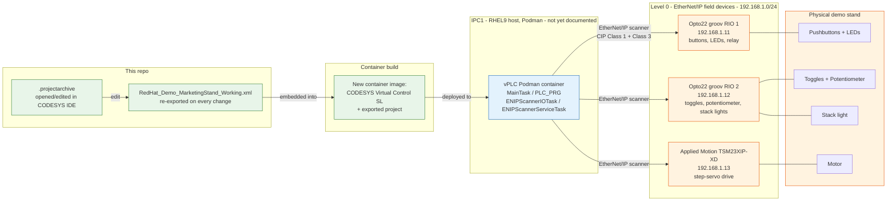

# CODESYS workflow — Marketing Demo Stand

This doc focuses on **Purdue Model Level 0 (physical process) and Level 1 (basic control)** for the marketing demo stand: the field devices themselves, the CODESYS logic that controls them, and how a logic change turns into a running container on IPC1. It does not cover the platform/GitOps layers (IPC4 build, Gitea, ArgoCD, SNO) — see [HOW_IT_WORKS.md](../../HOW_IT_WORKS.md) for that.

## 1) What's in this folder

- **`RedHat_Demo_MarketingStand_Working.xml`** — a plain-text CODESYS project export (`Project → Export`). This is the git-friendly artifact: diffable, reviewable, small enough to track normally. It contains the full device tree, task configuration, POUs, and global variables, but not compiled binaries or referenced libraries.
- **`09_19_426pmRedHat_Demo_MarketingStand_Working.projectarchive`** — the full CODESYS project archive (`.projectarchive`), including referenced libraries and everything needed to reopen and rebuild the project as-is in the IDE. Large binary file — tracked via **Git LFS** (see the main [README.md](../../README.md#codesys-ide-win11-on-ocp-v), step 12).

Treat the `.xml` as the reviewable record of what the logic does; treat the `.projectarchive` as the thing you actually open in CODESYS IDE to keep working on it.

## 2) Level 0 — the physical process

Level 0 of the Purdue Model is the physical process itself: the sensors and actuators that do the actual work, with no logic of their own. On this demo stand that's pushbuttons, indicator LEDs, toggle switches, a potentiometer, a three-color stack light, a relay, and a small motor — wired to three EtherNet/IP field devices on the `192.168.1.0/24` network:

| Device | Role | Address | I/O it exposes |
|---|---|---|---|
| `Opto22_RIO1` — [groov RIO](https://www.opto22.com/products/groov-rio) | Universal edge I/O | `192.168.1.11` | `Red_Button`, `Green_Button`, `Blue_Button` (digital in) → `Red_Button_LED`, `Green_Button_LED`, `Blue_Button_LED` (digital out); `Relay_In`, `Relay_Out` |
| `Opto22_RIO2` — [groov RIO](https://www.opto22.com/products/groov-rio) | Universal edge I/O | `192.168.1.12` | `Toggle_1`, `Toggle_2` (digital in), `Potentiometer` (analog in) → `Red_Stacklight`, `Yellow_Stacklight`, `Green_Stacklight` (digital out) |
| `TSM23XIP_XD` — Applied Motion [TSM23 integrated step-servo](https://www.applied-motion.com/products/series/ethernet-ip-products) | Motion / actuation | `192.168.1.13` | Demo motor motion commands + status, over CIP explicit and implicit (I/O) messaging |

**groov RIO** (Opto 22): a rack-free, PoE-powered edge I/O module. Each unit here provides 8 software-configurable channels (any mix of digital/analog in or out) plus 2 electromechanical relays, an onboard I/O processor, and — beyond the EtherNet/IP CIP adapter mode used by this project — native support for MQTT/Sparkplug, OPC UA, Modbus/TCP and REST, none of which this demo currently uses. Reference: [ETH-IP-IO-Module](../ETH-IP-IO-Module/) in this repo (`groovFind.exe` for discovery, the groov RIO user's guide), and Opto 22's own [groov RIO data sheet](https://documents.opto22.com/2317_groov_RIO_Data_Sheet.pdf).

**TSM23XIP-XD** (Applied Motion Products): a NEMA 23 integrated closed-loop step-servo — motor, drive electronics, and an EtherNet/IP interface combined into one unit, powered at 24–48VDC. It exposes over 100 commands and 130 registers over EtherNet/IP for motion control, I/O, and configuration. Reference: [ETH-IP-StepServoDrive](../ETH-IP-StepServoDrive/) in this repo (hardware manual, EDS file, step-servo tuner utility), and Applied Motion's [EtherNet/IP product line](https://www.applied-motion.com/products/series/ethernet-ip-products).

All three are **EtherNet/IP CIP adapters** (targets): they accept the Class 1 (implicit, cyclic I/O) connection from a scanner and expose input/output assemblies, and also answer Class 3 (explicit) service requests. They never initiate traffic themselves — that's the scanner's job, which is where Level 1 comes in.

## 3) Level 1 — basic control (the vPLC)

Level 1 is the controller that closes the loop on Level 0: it scans inputs, runs logic, and drives outputs. Here that's a **CODESYS soft-PLC runtime (vPLC) running as a Podman container on IPC1** (a RHEL9 host — not yet documented elsewhere in this repo). The runtime is [CODESYS Virtual Control SL](https://www.codesys.com/products/runtime/virtual-control-sl/), CODESYS's runtime built specifically to run under a container or hypervisor rather than bare metal.

Inside the `Device` → `Application`, the project structure is:

- **`PLC_PRG`** — the main program, cyclically scheduled by **`MainTask`**. It reads the Level 0 inputs (buttons, toggles, potentiometer), runs the demo logic, and writes the Level 0 outputs (LEDs, stack lights, motor commands).
- **`FUNC_SCALE`** — scales the raw `Potentiometer` analog reading into an engineering-range value used elsewhere in the logic.
- **`LIGHT_CYCLE`** — drives the red/yellow/green stack-light sequencing.
- **`MOTOR`** — issues motion commands to the `TSM23XIP_XD` servo drive.
- **`GVL`** — the global variable list binding these POUs to the actual I/O channel names shown in the table above.

The EtherNet/IP side of Level 1 is handled by the `Ethernet` → `EtherNet_IP_Scanner` device, which acts as the CIP **scanner** (connection originator) for all three Level 0 adapters, and by two dedicated tasks:

- **`ENIPScannerIOTask`** — the cyclic Class 1 I/O scan: pulls current input assemblies from `Opto22_RIO1`/`Opto22_RIO2`/`TSM23XIP_XD` and pushes current output assemblies to them, on every scan.
- **`ENIPScannerServiceTask`** — Class 3 explicit/service messaging (e.g. one-off parameter reads/writes, diagnostics) to the same three devices.

For this to reach the field devices, IPC1's network interface carrying the vPLC container needs an address on `192.168.1.0/24` — the same segment `Opto22_RIO1`, `Opto22_RIO2`, and `TSM23XIP_XD` live on.

## 4) Change → build → deploy workflow

1. An engineer edits the logic in CODESYS IDE, opening the `.projectarchive` from this folder, and re-exports the project to `RedHat_Demo_MarketingStand_Working.xml` (re-saving the `.projectarchive` too) — both get committed back to this repo, so the demo logic stays version-controlled.
2. A new container image is built that embeds the exported project on top of the CODESYS Virtual Control SL runtime base image. (The build pipeline/Containerfile for this is not yet documented in this repo.)
3. The new image is deployed to run as a **Podman** container on **IPC1** (RHEL9 host — not yet documented in this repo).
4. On start, the containerized vPLC loads the project, `MainTask`/`PLC_PRG` begins cycling, and the EtherNet/IP scanner opens Class 1 connections to `Opto22_RIO1`, `Opto22_RIO2`, and `TSM23XIP_XD` over IPC1's `192.168.1.0/24` interface.
5. Level 1 now closes the loop on Level 0 continuously: button/toggle/potentiometer state in, LED/stack-light/servo-motion commands out.

## Diagram

