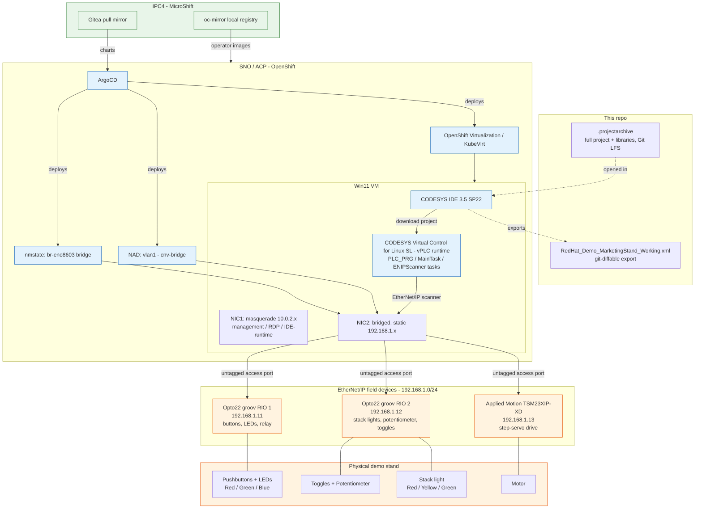

# CODESYS workflow — Marketing Demo Stand

How the `RedHat_Demo_MarketingStand_Working` CODESYS project gets from source in this repo to running PLC logic driving the physical demo stand, and how that fits into the rest of the SPS-2025 stack (IPC4 → SNO/ACP → Win11 VM).

## 1) What's in this folder

- **`RedHat_Demo_MarketingStand_Working.xml`** — a plain-text CODESYS project export (`Project → Export`). This is the git-friendly artifact: diffable, reviewable, small enough to track normally. It contains the full device tree, task configuration, POUs, and global variables, but not compiled binaries or referenced libraries.
- **`09_19_426pmRedHat_Demo_MarketingStand_Working.projectarchive`** — the full CODESYS project archive (`.projectarchive`), including referenced libraries and everything needed to reopen and rebuild the project as-is in the IDE. Large binary file — tracked via **Git LFS** (see the main [README.md](../../README.md#codesys-ide-win11-on-ocp-v), step 12).

Treat the `.xml` as the reviewable record of what the logic does; treat the `.projectarchive` as the thing you actually open in CODESYS IDE to keep working on it.

## 2) The physical demo stand and its I/O

The stand's I/O is split across two Opto 22 **groov RIO** EtherNet/IP I/O modules and one Applied Motion Products **TSM23XIP-XD** integrated step-servo drive, all on the `192.168.1.0/24` industrial network:

| Device | Role | Address |
|---|---|---|
| `Opto22_RIO1` | Red/Green/Blue pushbuttons + their LEDs, `Relay_In`, `Relay_Out` | `192.168.1.11` |
| `Opto22_RIO2` | Red/Yellow/Green stack lights, `Potentiometer` (analog in), `Toggle_1`, `Toggle_2` | `192.168.1.12` |
| `TSM23XIP_XD` | Integrated step-servo drive driving the demo motor | `192.168.1.13` (configured in the EtherNet/IP scanner's target-IP parameter) |

Reference material for these devices lives alongside this folder: [ETH-IP-IO-Module](../ETH-IP-IO-Module/) (groov RIO — `groovFind.exe` for discovery, groov RIO user guide) and [ETH-IP-StepServoDrive](../ETH-IP-StepServoDrive/) (TSM23XIP-XD hardware manual, EDS file, step-servo tuner).

## 3) CODESYS project structure (logic)

Under the `Device` → `Application`:

- **`PLC_PRG`** — main program, scheduled by **`MainTask`**.
- **`ENIPScannerIOTask`** / **`ENIPScannerServiceTask`** — the two tasks the EtherNet/IP scanner uses to cycle I/O data and handle service/explicit messaging with the three field devices above.
- **`FUNC_SCALE`** — scales a raw input (the `Potentiometer` reading) to an engineering range.
- **`LIGHT_CYCLE`** — drives the stack-light sequencing logic.
- **`MOTOR`** — commands the `TSM23XIP_XD` servo drive.
- **`GVL`** — global variable list tying the I/O channel mappings together.

The device tree (`Ethernet` → `EtherNet_IP_Scanner`) is what maps these POUs to the physical channels listed in §2 — e.g. `Opto22_RIO1`'s channels are named directly after the buttons/relay they represent (`Red_Button`, `Blue_Button_LED`, `Relay_Out`, ...).

## 4) Where it runs: IDE + vPLC on the Win11 VM

Per the main [README.md](../../README.md#codesys-ide-win11-on-ocp-v) setup steps, the Windows 11 VM (created via the `kubevirt-tekton-tasks` windows-efi-installer pipeline — [workloads/WIN11-VM](../WIN11-VM/) — running under OpenShift Virtualization on the SNO/ACP cluster) hosts two things:

- **CODESYS IDE 3.5 SP22** — the engineering tool used to open/edit the project and download logic to the runtime.
- **CODESYS Virtual Control for Linux SL** (the **vPLC**) — the actual soft-PLC runtime that executes `PLC_PRG` and runs the EtherNet/IP scanner talking to the three field devices.

The VM has two virtual NICs for two different jobs:

- The original **masquerade** interface (10.0.2.x) — management/programming access: RDP into the VM, SSH, and CODESYS IDE↔runtime communication if done locally on the VM.
- The **bridged** interface, via the `vlan1` `NetworkAttachmentDefinition` (`cnv-bridge` CNI, bound to the `br-eno8603` Linux bridge, itself on the physical `eno8603` port as a plain untagged access port) — this is what puts the vPLC's EtherNet/IP scanner directly on the `192.168.1.0/24` segment the three field devices live on, with a manually-configured static IP (no DHCP on that network). See [Troubleshoot-July2026.md](../../Troubleshoot-July2026.md) for how that bridge was set up and made durable across a reinstall, and [HOW_IT_WORKS.md](../../HOW_IT_WORKS.md) for the broader GitOps mechanics behind it.

## 5) End-to-end workflow

1. **IPC4** builds MicroShift, brings up Gitea (mirroring `acp-standard-services-public`) and the local operator mirror.
2. **SNO/ACP** installs from the generated agent ISO; ArgoCD syncs `acp-standard-services`, which brings in `kubevirt-hyperconverged` (OpenShift Virtualization), the `kubernetes-nmstate-operator`, and — via the values described in §4 — the `br-eno8603` bridge and `vlan1` NAD.
3. The **Win11 VM** is created via the windows-efi-installer pipeline, then CODESYS IDE and the vPLC runtime are installed manually per the README steps, and the `vlan1` interface is attached to the VM.
4. The `.projectarchive` from this folder is opened in CODESYS IDE on the VM, missing device descriptions are resolved (Opto 22 library from the Opto 22 store, TSM23XIP-XD EDS from [workloads/ETH-IP-StepServoDrive](../ETH-IP-StepServoDrive/)), and the project is downloaded to the local vPLC runtime.
5. The vPLC's EtherNet/IP scanner, now reachable on `192.168.1.0/24` through the bridged NIC, connects to the two `groov RIO` modules and the `TSM23XIP-XD` drive and starts cycling I/O — buttons/toggles/potentiometer in, LEDs/stack lights/servo motion out.
6. Logic changes made in the IDE get re-exported to `RedHat_Demo_MarketingStand_Working.xml` (and the `.projectarchive` re-saved) and committed back to this repo, so the demo logic stays version-controlled alongside the rest of the stack.

## Diagram

