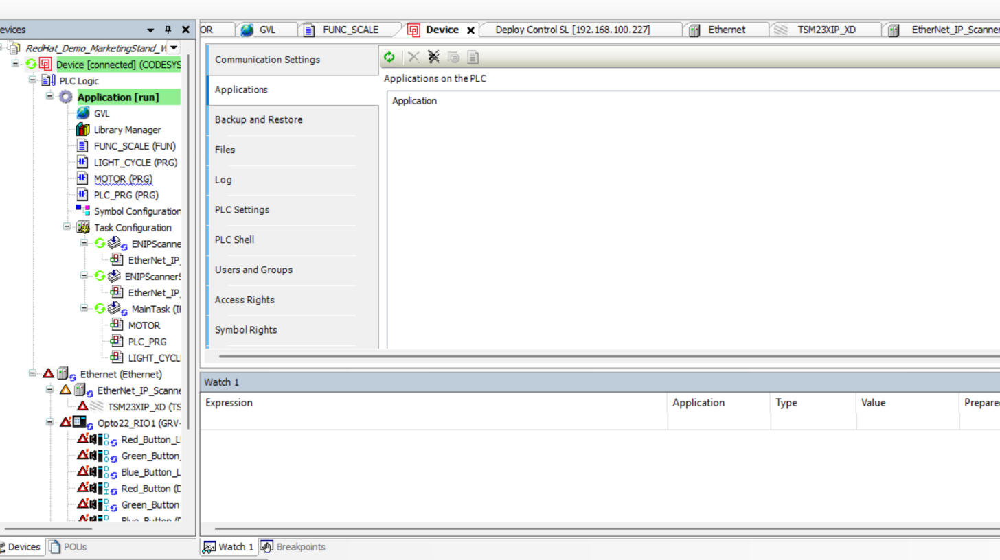
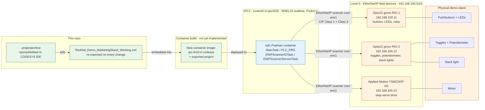
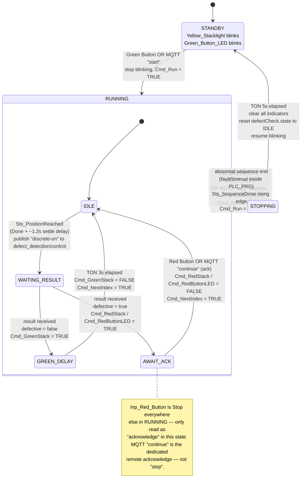

# CODESYS workflow — Marketing Demo Stand

This doc focuses on **Purdue Model Level 0 (physical process) and Level 1 (basic control)** for the marketing demo stand: the field devices themselves, the CODESYS logic that controls them, and how a logic change gets deployed to the vPLC running on IPC2. It does not cover the platform/GitOps layers (IPC4 build, Gitea, ArgoCD, SNO) — see [HOW_IT_WORKS.md](../../HOW_IT_WORKS.md) for that.

## 1) What's in this folder

There are **two versions of the CODESYS project** tracked side by side in this folder — the original demo logic, and the current one described in [§7) Defect-check workflow (IMPROVED)](#7-defect-check-workflow-improved) below. Both are kept around: the previous version as a reference/rollback point, the `_IMPROVED` version as the one actually deployed to the `vplc` instance today. See [§6) Previous version of the application](#6-previous-version-of-the-application) for what the original logic did.

**Previous version:**

- **`RedHat_Demo_MarketingStand_Working.xml`** — a plain-text CODESYS project export (`Project → Export`). This is the git-friendly artifact: diffable, reviewable, small enough to track normally. It contains the full device tree, task configuration, POUs, and global variables, but not compiled binaries or referenced libraries.
- **`RedHat_Demo_MarketingStand_Working.projectarchive`** — the full CODESYS project archive (`.projectarchive`), including referenced libraries and everything needed to reopen and rebuild the project as-is in the IDE. Large binary file — tracked via **Git LFS** (see the main [README.md](../../README.md#codesys-ide-win11-on-ocp-v), step 12).

**Current (`_IMPROVED`) version:**

- **`RedHat_Demo_MarketingStand_Working_IMPROVED.projectarchive`** — the full project archive for the current version, same role as above: the file to actually open in CODESYS IDE to keep working on the logic. Also tracked via Git LFS.
- **`RedHat_Demo_MarketingStand_Working_IMPROVED.project`** — the native CODESYS project file (no bundled libraries) — a lighter-weight save of the same project, useful when the libraries it depends on are already installed in the IDE you're opening it with. You can find a versioned repo for the changes that brought the project from previous to current version [here](https://github.com/RedHatEdge/sps-2025-codesys/tree/main)
- **`RedHat_Demo_MarketingStand_Working_IMPROVED.Device.Application.xml`** — a plain-text export scoped to just the `Device` → `Application` object (POUs and global variables), rather than the whole project/device tree — the practical git-diffable artifact for reviewing logic changes, since re-exporting just the application is quicker than a full project export on every change.

Treat the `.xml`/`.Device.Application.xml` exports as the reviewable record of what the logic does; treat the `.projectarchive`/`.project` as the things you actually open in CODESYS IDE to keep working on it.

## 2) Level 0 — the physical process

Level 0 of the Purdue Model is the physical process itself: the sensors and actuators that do the actual work, with no logic of their own. On this demo stand that's pushbuttons, indicator LEDs, toggle switches, a potentiometer, a three-color stack light, a relay, and a small motor — wired to three EtherNet/IP field devices on the `192.168.100.0/24` network:

| Device | Role | Address | I/O it exposes |
|---|---|---|---|
| `Opto22_RIO1` — [groov RIO](https://www.opto22.com/products/groov-rio) | Universal edge I/O | `192.168.100.11` | `Red_Button`, `Green_Button`, `Blue_Button` (digital in) → `Red_Button_LED`, `Green_Button_LED`, `Blue_Button_LED` (digital out); `Relay_In`, `Relay_Out` |
| `Opto22_RIO2` — [groov RIO](https://www.opto22.com/products/groov-rio) | Universal edge I/O | `192.168.100.12` | `Toggle_1`, `Toggle_2` (digital in), `Potentiometer` (analog in) → `Red_Stacklight`, `Yellow_Stacklight`, `Green_Stacklight` (digital out) |
| `TSM23XIP_XD` — Applied Motion [TSM23 integrated step-servo](https://www.applied-motion.com/products/series/ethernet-ip-products) | Motion / actuation | `192.168.100.13` | Demo motor motion commands + status, over CIP explicit and implicit (I/O) messaging |

**groov RIO** (Opto 22): a rack-free, PoE-powered edge I/O module. Each unit here provides 8 software-configurable channels (any mix of digital/analog in or out) plus 2 electromechanical relays, an onboard I/O processor, and — beyond the EtherNet/IP CIP adapter mode used by this project — native support for MQTT/Sparkplug, OPC UA, Modbus/TCP and REST, none of which this demo currently uses. Reference: [ETH-IP-IO-Module](../ETH-IP-IO-Module/) in this repo (`groovFind.exe` for discovery, the groov RIO user's guide), and Opto 22's own [groov RIO data sheet](https://documents.opto22.com/2317_groov_RIO_Data_Sheet.pdf).

**TSM23XIP-XD** (Applied Motion Products): a NEMA 23 integrated closed-loop step-servo — motor, drive electronics, and an EtherNet/IP interface combined into one unit, powered at 24–48VDC. It exposes over 100 commands and 130 registers over EtherNet/IP for motion control, I/O, and configuration. Reference: [ETH-IP-StepServoDrive](../ETH-IP-StepServoDrive/) in this repo (hardware manual, EDS file, step-servo tuner utility), and Applied Motion's [EtherNet/IP product line](https://www.applied-motion.com/products/series/ethernet-ip-products).

All three are **EtherNet/IP CIP adapters** (targets): they accept the Class 1 (implicit, cyclic I/O) connection from a scanner and expose input/output assemblies, and also answer Class 3 (explicit) service requests. They never initiate traffic themselves — that's the scanner's job, which is where Level 1 comes in.

## 3) Level 1 — basic control (the vPLC)

Level 1 is the controller that closes the loop on Level 0: it scans inputs, runs logic, and drives outputs. Here that's a **CODESYS soft-PLC runtime (vPLC) running as a Podman container on IPC2** (hostname `control2-rt.sps2025`, a bootc image built from `quay.io/luferrar/sps:ipc-rh10-rt` — RHEL10 with a realtime kernel; see `images/ipc2/ContainerfileCodesys`). The runtime is [CODESYS Virtual Control SL](https://www.codesys.com/products/runtime/virtual-control-sl/), CODESYS's runtime built specifically to run under a container or hypervisor rather than bare metal. §4 covers how it's deployed manually today; §5 covers the target build/push/deploy workflow for shipping application changes as a new container image.

IPC2 has **two network roles** split across separate interfaces:

- **`eno1`, `192.168.100.225/24`** — dedicated to the vPLC container for EtherNet/IP CIP traffic, mapped in via the instance's `Nic` setting. This is on the same `192.168.100.0/24` segment as `Opto22_RIO1`, `Opto22_RIO2`, and `TSM23XIP_XD`.
- **`192.168.100.227`** — IPC2's management address, used for the CODESYS Gateway connection from the IDE (port `11740`, opened through the firewall for remote management) and for CodeMeter license-server discovery.

The container also exposes `4840` (OPC UA server) and `8080` (WebVisu/HTTP) alongside `11740`. Licensing runs through CodeMeter (WIBU-SYSTEMS) — the container's instance config points its `License Server` setting at `192.168.100.223`; the host itself also runs `codemeter.service` (installed via `images/ipc2/CodeMeter-lite-8.40.7131-502.x86_64.rpm`, see `images/ipc2/ContainerfileCodesys`).

Inside the `Device` → `Application`, the project structure is built around the same core set of POUs in both versions of the project (see [§1](#1-whats-in-this-folder)) — what differs between them is what these POUs actually do internally, and (in the current version) two additional POUs layered on top. The core set:

- **`PLC_PRG`** — the main program, cyclically scheduled by **`MainTask`**. It reads the Level 0 inputs (buttons, toggles, potentiometer), runs the demo logic, and writes the Level 0 outputs (LEDs, stack lights, motor commands).
- **`FUNC_SCALE`** — scales the raw `Potentiometer` analog reading into an engineering-range value used elsewhere in the logic. Unchanged between versions.
- **`LIGHT_CYCLE`** — drives the red/yellow/green stack-light sequencing.
- **`MOTOR`** — issues motion commands to the `TSM23XIP_XD` servo drive.
- **`GVL`** — the global variable list binding these POUs to the actual I/O channel names shown in the table above.

For what each of these actually does, see [§6) Previous version of the application](#6-previous-version-of-the-application) for the original logic, or [§7) Defect-check workflow (IMPROVED)](#7-defect-check-workflow-improved) — which also introduces `SEQ_SUPERVISOR` and `DEFECT_CHECK`, not present in the previous version — for the current one.

The EtherNet/IP side of Level 1 is handled by the `Ethernet` → `EtherNet_IP_Scanner` device, which acts as the CIP **scanner** (connection originator) for all three Level 0 adapters, and by two dedicated tasks:

- **`ENIPScannerIOTask`** — the cyclic Class 1 I/O scan: pulls current input assemblies from `Opto22_RIO1`/`Opto22_RIO2`/`TSM23XIP_XD` and pushes current output assemblies to them, on every scan.
- **`ENIPScannerServiceTask`** — Class 3 explicit/service messaging (e.g. one-off parameter reads/writes, diagnostics) to the same three devices.

This is what actually reaches the field devices over `eno1`, as described above.

## 4) Manual deployment of the Codesys Application to softPLC

Deploy Control SL (softPLC) to the Device (this will download the softPLC container image to the Device)


Connect to the new Device (via SSH)


Install Virtual Control to the Device (import image to Podman)
 

Installed!

```bash
[admin@control2-rt ~]$ sudo podman images
REPOSITORY                                     TAG                  IMAGE ID      CREATED       SIZE
quay.io/luferrar/sps                           ipc-rh10-rt-codesys  aa41f53b572c  11 hours ago  3.84 GB
quay.io/luferrar/sps                           ipc-rh10-rt          f85ac7a8d20f  16 hours ago  3.65 GB
docker.io/library/codesyscontrol_virtuallinux  4.21.0.0             a6590499224a  8 weeks ago   152 MB
```

Add a new instance of Virtual Control (configuration of a container)


New VPLC container


Configure exposed / mapped ports

>Notice how License server address is configured (if you have a valid license there) and Network section is filled in with an interface information (in this case eno1 has to be dedicated since we are using Eth/IP as protocol)  
> **REFERENCE** for configuration [here](https://content.helpme-codesys.com/en/CODESYS%20Control/_rtsl_reference.html) 

Start the instance


Opening target Device properties
  

Adding new Device (IPC2)  
*Use the other available interface to connect to the IPC*


Have to open firewall port 11740 for remote management


Connected!


Before uploading the application, make sure the IP addresses for Ethernet/IP components are correct
  
  
  


Deploy the application to VPLC (or upload a new version)  
  


User management for VPLC (using password `R3dh4t123!`)


Upload the application to VPLC


Start the application on VPLC


Codemeter Licensing


## 5) Target deployment workflow: build → push → deploy (NOT YET implemented)

[Workflow](#4-manual-deployment-of-the-codesys-application-to-softplc) above is how the application is deployed **today**: manually, through the CODESYS IDE's device wizard, onto a long-lived `vplc` Podman container running the stock `codesyscontrol_virtuallinux` image on IPC2. The intended target workflow instead bakes the application *into* the container image itself, so a logic change ships as a new image rather than an IDE upload:

1. An engineer edits the logic in CODESYS IDE, opening the `.projectarchive` from this folder, and re-exports the project to `RedHat_Demo_MarketingStand_Working.xml` (re-saving the `.projectarchive` too) — both get committed back to this repo, so the demo logic stays version-controlled.
2. A new container image is built on top of `images/ipc2/ContainerfileCodesys` (which already produces `quay.io/luferrar/sps:ipc-rh10-rt-codesys`, RHEL10 + the CodeMeter RPM), adding a layer that embeds the exported project into the CODESYS Virtual Control SL runtime. (This build step itself — how the project gets baked in — is not yet implemented.)
3. The new image is pushed to the registry and deployed to run as the `vplc` **Podman** container on **IPC2** (`control2-rt.sps2025`), replacing the manual "Deploy Control SL" + "Upload the application" steps in §4.
4. On start, the containerized vPLC loads the project, `MainTask`/`PLC_PRG` begins cycling, and the EtherNet/IP scanner opens Class 1 connections to `Opto22_RIO1`, `Opto22_RIO2`, and `TSM23XIP_XD` over the dedicated `eno1`/`192.168.100.225` interface.
5. Level 1 now closes the loop on Level 0 continuously: button/toggle/potentiometer state in, LED/stack-light/servo-motion commands out.

## Diagram for [target workflow](#5-target-deployment-workflow-build--push--deploy-not-yet-implemented)



## 6) Previous version of the application

This is the original demo logic — `RedHat_Demo_MarketingStand_Working.xml`/`.projectarchive` — before the MQTT-gated defect-check workflow in [§7](#7-defect-check-workflow-improved) was added. Same core POUs as the current version (`PLC_PRG`, `FUNC_SCALE`, `LIGHT_CYCLE`, `MOTOR`, `GVL`), no `SEQ_SUPERVISOR`/`DEFECT_CHECK`, and no MQTT involved anywhere.

- **`PLC_PRG`** — holding the Green Button latches `Cmd_Run` directly (no external supervisor involved); the Red Button is an unconditional Stop, full stop, with no other meaning. From there it runs the same underlying step-chain the current version still uses (fault check → enable the drive → issue a move → wait for it to finish → pause → loop back for the next move, or stop) — just without anything gating that loop-back on a camera result. Held down, the Green Button just keeps the disk indexing through its positions continuously, for demonstration purposes.
- **`FUNC_SCALE`** — the same potentiometer scaling helper, unchanged between versions.
- **`LIGHT_CYCLE`** — a small free-running engine: a single one-second timer cycles the stack light red → yellow → green (with two of the button LEDs riding along), on a loop, independent of anything else happening on the stand — just a visual effect, not tied to motor state or any analysis result.
- **`MOTOR`** — issues the same kind of motion commands to the `TSM23XIP_XD` servo drive as today, with distance and speed driven by the toggle-switch selector and potentiometer rather than fixed software-defined values.
- **`GVL`** — same binding role as today, without the additional `Cmd_*`/`Sts_*` variables the defect-check workflow later added.

End to end: press Green Button, the disk cycles continuously through its four positions while the stack lights run their own independent light show, until the Red Button stops it. No camera, no AI analysis, no acknowledge gate for a defective piece — those all arrived with the version in [§7](#7-defect-check-workflow-improved).

## 7) Defect-check workflow (IMPROVED)

The MQTT-gated defect-check design from earlier revisions of this doc has been built and is running on the `vplc` instance. Both the control flow (Standby↔Running↔Stopping, MQTT trigger/result round-trip, defect ack) and physical motion (indexing, servo tuning, settle-before-trigger timing) have been validated end-to-end via extensive live testing against the real hardware. This section documents what's actually deployed, corrected for everything that turned out different from the original plan during implementation.

### How the flow works (operator's POV)

For anyone approaching the stand fresh, here's the end-to-end behavior without any code:

1. **Standby** — the yellow stack light and the Green Button's LED blink slowly. The stand is idle, waiting.
2. **Press Green Button (or send `'start'` to the `plc_application/control` MQTT topic)** — the blinking stops, and the demo starts running continuously.
3. **Each cycle** — the motor indexes the disk to the next of its 4 fixed positions, waits briefly for the disk to physically settle (a fast index move overshoots slightly and needs a moment to stop swinging before the camera can trust its own position), then triggers the camera/AI analysis over MQTT.
4. **If the piece is good** — the green stack light comes on for 3 seconds, then the cycle repeats automatically. No operator action needed.
5. **If the piece is defective** — the red stack light and Red Button LED come on and *stay* on. The sequence deliberately pauses here: press the Red Button (or send `'continue'` to `plc_application/control` over MQTT) to acknowledge before the cycle continues.
6. **Press Red Button outside a defective-piece hold, or send `'stop'` over MQTT at any time** — stops the run. `'stop'` always stops the run, including while a defective piece is being held — it does not also act as an acknowledge. The stand finishes whatever it's mid-doing safely (it won't abandon the disk at a random angle between fixed positions), then returns to Standby after a short pause.
7. The physical Red Button and the MQTT commands aren't fully symmetric: the button's meaning is contextual — Stop normally, Acknowledge during a defective-piece hold, since there's only the one physical button — while over MQTT (`plc_application/control`) each action is its own dedicated command: `'start'`, `'stop'` (always stops), `'continue'` (acknowledge a hold).

Two design choices worth calling out explicitly: the settle-before-trigger delay exists because the servo visibly overshoots and corrects after a fast index move, and triggering the camera before that settles produces an unreliable image; and the defective-piece pause is deliberate, not a bug — it's there so a human has to actively clear a flagged piece rather than the line quietly continuing past it.

### Fixing the Zero Position of the motor 
You might notice that the position of the pieces and the camera is not correctly aligned, to correct this you can leverage a function inside the Application Logic. Since normal indexing now commands an **absolute** move (self-correcting quarter-turn target, see `Par_UseAbsoluteIndexing` in the Architecture section below), the manual nudge below has to temporarily switch `MOTOR` back to **relative** moves — otherwise `Sequence_Run = 50` would compute a fresh absolute quarter-turn target instead of honoring your small forced nudge. These are the steps:
- Force `MOTOR.Par_UseAbsoluteIndexing := FALSE` first. This routes `Sequence_Run = 50`'s move through `AMP_Relative_Move_0` (the relative-move FB) instead of `AMP_Absolute_Move_0`, so the nudge below actually takes effect. Only toggle this flag while `Sequence_Run = 0` (idle) — don't flip it mid-cycle.
- Force `Par_SoftwareDistance_Degrees` to a small nudge value — e.g. 5 (or -5 for the opposite direction, if you overshoot). Nothing else writes to this one, so it'll hold reliably.  
- Force `PLC_PRG.Sequence_Run := 10` . Starting from 10 lets the real fault-check/alarm-reset/enable logic run naturally (handles a residual fault automatically via its own 20 step if one's present, skips it if not), rather than risking a skipped precondition by jumping straight to the energize step. It'll progress on its own: 10 → 30 → 40 (energize, if needed) → 50 (issues the move using your forced 5°) → 55 (waits for Done) → 56.
- Watch it complete — `GVL.Sts_MoveDone` (the unified status bit `PLC_PRG` actually watches — mirrors `AMP_Relative_Move_0.Done` while `Par_UseAbsoluteIndexing = FALSE`) should fire, and you should see the small nudge happen physically.
- Force `Sequence_Run := 0` to release it back to idle before the next nudge.
- When happy with the alignment, set the target position value. Force `Par_SCL_Reg1 := 0` with set+F7.
- Trigger the zero/save sequence, forcing `Cmd_ZeroPosition := TRUE` once. MOTOR's existing Sequence_ZeroPosition mini-sequencer runs automatically from there — no new code needed.
- Watch the encoder complete its cycle. `Sequence_ZeroPosition` should progress 0 → 10 → 20 → 30 → 40 → 0. `GVL.AMP_SCL_0.Done` (the EP step) and `GVL.AMP_SCL_1.Done` (the SP step) should both go TRUE without `.Error` along the way
- **Force `MOTOR.Par_UseAbsoluteIndexing := TRUE` again** before resuming normal operation — while `Sequence_Run = 0`, same as before. Skipping this leaves the automatic cycle issuing relative moves instead of self-correcting absolute ones.
- Now you can rerun the program, stop and restart the SoftPLC so that forced values are cleared completely from memory.

### MQTT variables and others 

The **official CODESYS "MQTT Client SL"** library depends on the **Memory Block Manager** library (`MBM` namespace) internally, which had to be added separately — its absence produces `C0086: No definition found for interface 'MBM.IDisposable'` at build time.

Broker and topics, confirmed by live testing (not all were right on the first guess — see "Implementation notes" below):

| Purpose | Topic | Payload | Notes |
|---|---|---|---|
| Broker | `192.168.100.245`, port `1883` | — | All default of this installation that can / need to be changed including credentials (`admin`/`password`). |
| Analysis trigger (publish) | `defect_detection/control` | `'discrete-on'` | Discrete analysis control coming from the project [edge-defect-detector](https://github.com/lucamaf/edge-defect-detector) . |
| Analysis result (subscribe) | `defect_detection/results` | `{"defective":bool,"confidence":real,"timestamp":string,"piece":int}` | To be updated. |
| Remote start/stop/continue (subscribe) | `plc_application/control` | `'start'` / `'stop'` / `'continue'` | One shared topic/subscription rather than one per command, to avoid a third simultaneous `MQTTSubscribe` instance while it's still unclear whether the unlicensed library caps concurrent subscriptions. `'stop'` always stops the run, including mid-hold on a defective piece; `'continue'` is the dedicated remote acknowledge for a defective-piece hold (`AWAIT_ACK`) — kept as its own variable specifically so it doesn't share state with `'stop'` (see "Implementation notes"). |

Beyond the topics themselves, other variables worth tweaking or double-checking before/while running this on different hardware or in a different environment:

| Variable | Where | Current value | What it controls |
|---|---|---|---|
| `wsUsername` / `wsPassword` | `SEQ_SUPERVISOR.mqttClient` | `"admin"` / `"password"` | MQTT broker credentials — an unverified assumption that happens to work, per the broker row above; double-check against the actual broker config if this stops connecting. |
| `xUseTLS` / `eCommunicationMode` / `eMQTTVersion` | `SEQ_SUPERVISOR.mqttClient` | `FALSE` / `TCP` / `V3_1_1` | Plain TCP, no TLS, MQTT 3.1.1 — matches this broker; would need changing for a broker requiring TLS or MQTT 5. |
| `Par_SoftwareDistance_Degrees` | `MOTOR` | `90.0` | The per-index move distance. Matches the demo disk's 4 fixed positions (0/90/180/270°) — would need changing for a disk with a different number of positions or pieces positioned differently. |
| `Par_SoftwareSpeed` / `Par_AccelDeccel` | `MOTOR` | `0.6` / `0.4` (rev/sec, rev/sec² — **not RPM**, see below) | The move's speed and acceleration/deceleration profile. Confirmed smooth at these values on this hardware; re-tune if the disk/payload changes. |
| `StepsPerRotation` | `MOTOR` | `20000.0` | Steps per motor revolution — carried over from a forced value that worked, not independently re-verified against the drive's own electronic-gearing configuration. Double-check this against `TSM23XIP_XD`'s Step 1: Configuration in the Quick Tuner if distances start looking off. |
| `IndexPauseMin` / `IndexPauseMax` | `PLC_PRG` | `500` / `5000` (ms) | The potentiometer-scaled pause between indices. Placeholder values, not tuned against the actual camera/analysis round-trip time or desired demo pacing. |
| `TON_SettleDelay`'s `PT` | `PLC_PRG`, Network 9 | `T#1S` | How long to wait after the drive reports a move `Done` before arming the defect-check trigger, to let the disk's position-loop overshoot correction finish settling. Increase if the camera still triggers before the disk is visibly still; decrease to tighten cycle time if it's over-waiting. |
| P Loop gains (`KP`/`KD`/`KE`) | Drive itself, not CODESYS — set via Applied Motion's Step-Servo Quick Tuner | `300` / `20` / `10` | Not a CODESYS variable at all, but worth listing here since it directly affects the same settle behavior `TON_SettleDelay` compensates for — see "Servo tuning" below. Re-tuning the drive (or swapping drives) means re-checking these. |
| SW CCW/CW position limits | Drive itself, via Quick Tuner | should be **cleared/disabled** | Used temporarily during servo tuning to bound test moves — must be cleared before normal operation, since the demo's indexing doesn't respect them and will fault if left too narrow. Nothing in the PLC checks for or clears these automatically; see "Servo tuning" below. |

### Architecture

The current application is built from seven POUs plus one named type, working together as follows:

- **`SEQ_SUPERVISOR`** (PRG) — the top-level Standby/Running/Stopping supervisor, and the entry point for how the demo actually starts and stops. Owns the MQTT client connection, the Standby blink, the remote start/stop listener, and one `DEFECT_CHECK` instance. Wired into `MainTask` alongside `MOTOR`/`PLC_PRG`/`LIGHT_CYCLE`.
- **`DEFECT_CHECK`** (FB) — the per-cycle defect-check state machine: publishes the analysis trigger once the disk has settled into position, waits for the camera/AI result over MQTT, and drives either the green-delay-and-continue outcome or the red-hold-for-acknowledge outcome.
- **`PLC_PRG`** — the motion sequencer. Started/stopped externally by `SEQ_SUPERVISOR` rather than latching the Green Button itself, it steps the drive through fault-check → enable → issue the move → wait for it to finish and settle → pause (gated on `DEFECT_CHECK` having released the current index) → loop back for the next move, or stop.
- **`MOTOR`** — issues the actual motion commands to the `TSM23XIP_XD` servo drive: distance, speed, acceleration/deceleration, plus the zero-position mini-sequencer described above.
- **`LIGHT_CYCLE`** — drives the stack lights and button LEDs directly from the `Cmd_*` bits `SEQ_SUPERVISOR`/`DEFECT_CHECK` set, rather than running its own independent cycle.
- **`FUNC_SCALE`** — the potentiometer scaling helper, used the same way as in the previous version.
- **`GVL`** — the global variable list binding all of the above to the real I/O channel names, plus the `Cmd_*`/`Sts_*` coordination variables the defect-check workflow uses to talk between POUs.
- **`E_DefectState`** (DUT, named enum) — `(IDLE, WAITING_RESULT, GREEN_DELAY, AWAIT_ACK)`, `DEFECT_CHECK`'s state values. Has to be a separately-named `TYPE`, not inline/anonymous — CODESYS scopes anonymous enum literals to their declaring POU only, so `DEFECT_CHECK`'s own `state` field wouldn't be referenceable from `SEQ_SUPERVISOR` otherwise.

```iecst
TYPE E_DefectState :
(
    IDLE,
    WAITING_RESULT,
    GREEN_DELAY,
    AWAIT_ACK
);
END_TYPE
```

```iecst
FUNCTION_BLOCK DEFECT_CHECK
VAR_INPUT
    state           : E_DefectState := E_DefectState.IDLE;
    xRemoteContinue : BOOL;
END_VAR
VAR_IN_OUT
    mqttClient : MQTT.MQTTClient;
END_VAR
VAR
    mqttPublisher  : MQTT.MQTTPublish;
    mqttSubscriber : MQTT.MQTTSubscribe;
    tonGreenDelay  : TON;
    trigPublish    : R_TRIG;
    xArmPublish    : BOOL;
    sPublishMsg    : STRING(20) := 'discrete-on';
    wsControlTopic : WSTRING(1024) := "defect_detection/control";
    wsResultFilter : WSTRING(1024) := "defect_detection/results";
    sResultBuffer  : STRING(255);
    defective      : BOOL;
END_VAR

mqttSubscriber(
    xEnable           := mqttClient.xConnectedToBroker,
    eSubscribeQoS     := MQTT.MQTT_QOS.QOS0,
    pbPayload         := ADR(sResultBuffer),
    udiMaxPayloadSize := SIZEOF(sResultBuffer),
    mqttClient        := mqttClient,
    wsTopicFilter     := wsResultFilter
);

trigPublish(CLK := xArmPublish);
mqttPublisher(
    xExecute       := trigPublish.Q,
    pbPayload      := ADR(sPublishMsg),
    udiPayloadSize := DINT_TO_UDINT(LEN(sPublishMsg)),
    mqttClient     := mqttClient,
    wsTopicName    := wsControlTopic
);
xArmPublish := FALSE;

CASE state OF
    E_DefectState.IDLE:
        IF GVL.Sts_PositionReached THEN
            xArmPublish := TRUE;
            state := E_DefectState.WAITING_RESULT;
        END_IF

    E_DefectState.WAITING_RESULT:
        IF mqttSubscriber.xReceived THEN
            defective := FIND(sResultBuffer, '"defective": true') > 0;
            IF defective THEN
                GVL.Cmd_RedStack     := TRUE;
                GVL.Cmd_RedButtonLED := TRUE;
                state := E_DefectState.AWAIT_ACK;
            ELSE
                GVL.Cmd_GreenStack := TRUE;
                tonGreenDelay(IN := TRUE, PT := T#3S);
                state := E_DefectState.GREEN_DELAY;
            END_IF
        END_IF

    E_DefectState.GREEN_DELAY:
        tonGreenDelay(IN := TRUE, PT := T#3S);
        IF tonGreenDelay.Q THEN
            GVL.Cmd_GreenStack := FALSE;
            tonGreenDelay(IN := FALSE);
            GVL.Cmd_NextIndex := TRUE;
            state := E_DefectState.IDLE;
        END_IF

    E_DefectState.AWAIT_ACK:
        IF NOT Inp_Red_Button.State OR xRemoteContinue THEN
            GVL.Cmd_RedStack     := FALSE;
            GVL.Cmd_RedButtonLED := FALSE;
            GVL.Cmd_NextIndex    := TRUE;
            state := E_DefectState.IDLE;
        END_IF
END_CASE
```

```iecst
PROGRAM SEQ_SUPERVISOR
VAR
    machineState    : (STANDBY, RUNNING, STOPPING) := STANDBY;
    mqttClient      : MQTT.MQTTClient;
    defectCheck     : DEFECT_CHECK;
    tonBlinkOn      : TON;
    tonBlinkOff     : TON;
    blinkOut        : BOOL;
    tonStopRecovery : TON;
    trigSequenceDone : R_TRIG;

    remoteControlSub     : MQTT.MQTTSubscribe;
    wsRemoteControlTopic : WSTRING(1024) := "plc_application/control";
    sRemoteControlBuffer : STRING(255);
    xRemoteStart          : BOOL;
    xRemoteStop            : BOOL;
    xRemoteContinue         : BOOL;
END_VAR

// MQTT connection maintained continuously, independent of machineState
mqttClient(
    xEnable            := TRUE,
    sHostname          := '192.168.100.245',
    uiPort             := 1883,
    xUseTLS            := FALSE,
    xCleanSession      := TRUE,
    wsUsername         := "admin",
    wsPassword         := "password",
    eCommunicationMode := MQTT.COMMUNICATION_MODE.TCP,
    eMQTTVersion       := MQTT.MQTT_VERSION.V3_1_1
);

// remote start/stop listener — one topic, distinguished by payload
remoteControlSub(
    xEnable           := mqttClient.xConnectedToBroker,
    eSubscribeQoS     := MQTT.MQTT_QOS.QOS0,
    pbPayload         := ADR(sRemoteControlBuffer),
    udiMaxPayloadSize := SIZEOF(sRemoteControlBuffer),
    mqttClient        := mqttClient,
    wsTopicFilter     := wsRemoteControlTopic
);
xRemoteStart    := remoteControlSub.xReceived AND FIND(sRemoteControlBuffer, 'start') > 0;
xRemoteStop     := remoteControlSub.xReceived AND FIND(sRemoteControlBuffer, 'stop') > 0;
xRemoteContinue := remoteControlSub.xReceived AND FIND(sRemoteControlBuffer, 'continue') > 0;

// called unconditionally every scan, regardless of machineState — keeps the
// MQTT publisher/subscriber warm across Stopping/Standby instead of going
// cold and needing a fresh reconnect on the next Running session.
// xRemoteContinue (not xRemoteStop) feeds DEFECT_CHECK deliberately — see
// the call-order gotcha in "Implementation notes" below for why sharing
// xRemoteStop between here and the RUNNING case caused a real bug.
defectCheck(mqttClient := mqttClient, xRemoteContinue := xRemoteContinue);

// edge-triggered on purpose — PLC_PRG.Sts_SequenceDone can still be sitting
// TRUE (stale, from the tail end of the previous run) at the exact moment a
// fresh Running session begins; a level check would bounce straight back out
// to Stopping before the new run ever gets a chance to move. Only a genuine
// rising edge — an abnormal end happening *during this* Running session —
// should trigger the auto-recovery abort below.
trigSequenceDone(CLK := PLC_PRG.Sts_SequenceDone);

CASE machineState OF
    STANDBY:
        tonBlinkOn(IN := NOT blinkOut, PT := T#500MS);
        tonBlinkOff(IN := blinkOut, PT := T#500MS);
        IF tonBlinkOn.Q THEN
            blinkOut := TRUE;
        END_IF
        IF tonBlinkOff.Q THEN
            blinkOut := FALSE;
        END_IF
        GVL.Cmd_YellowStackBlink    := blinkOut;
        GVL.Cmd_GreenButtonLEDBlink := blinkOut;

        IF Inp_Green_Button.State OR xRemoteStart THEN
            tonBlinkOn(IN := FALSE);
            tonBlinkOff(IN := FALSE);
            GVL.Cmd_YellowStackBlink    := FALSE;
            GVL.Cmd_GreenButtonLEDBlink := FALSE;
            defectCheck.state := E_DefectState.IDLE;
            GVL.Cmd_NextIndex := FALSE;   // clear any stale leftover from an aborted previous run
            PLC_PRG.Cmd_Run := TRUE;
            machineState := RUNNING;
        END_IF

    RUNNING:
        // Physical Red Button keeps its contextual dual-meaning (Stop outside
        // AWAIT_ACK, Acknowledge inside it, handled by DEFECT_CHECK). Remote
        // 'stop' is unconditional on purpose — always stops, even mid-hold —
        // so a remote operator gets predictable behavior regardless of state.
        IF (NOT Inp_Red_Button.State AND defectCheck.state <> E_DefectState.AWAIT_ACK) OR xRemoteStop THEN
            PLC_PRG.Cmd_Run := FALSE;
            tonStopRecovery(IN := TRUE, PT := T#5S);
            machineState := STOPPING;
        END_IF
        IF trigSequenceDone.Q THEN
            PLC_PRG.Cmd_Run := FALSE;
            tonStopRecovery(IN := TRUE, PT := T#5S);
            machineState := STOPPING;
        END_IF

    STOPPING:
        tonStopRecovery(IN := TRUE, PT := T#5S);
        IF tonStopRecovery.Q THEN
            tonStopRecovery(IN := FALSE);
            GVL.Cmd_GreenStack   := FALSE;
            GVL.Cmd_RedStack     := FALSE;
            GVL.Cmd_RedButtonLED := FALSE;
            defectCheck.state    := E_DefectState.IDLE;
            machineState := STANDBY;
        END_IF
END_CASE
```


### `PLC_PRG` — translated from ladder to Structured Text, patched

Rewritten from the original ladder logic into ST (kept functionally identical — verified network-by-network against the real ladder in the IDE) so the defect-check patch could be applied as ordinary text edits instead of ladder-diagram surgery. `Cmd_Run` had to move from a plain `VAR` to `VAR_INPUT`, since `SEQ_SUPERVISOR` needs to write it from outside — CODESYS only allows external writes to `VAR_INPUT`/`VAR_IN_OUT`, never a plain `VAR`.

The defect-check patch itself, against the real (ST-translated) ladder networks:

- **Network 1** (safe-state/`Cmd_Stop`): removed the `NOT Inp_Red_Button.State` term specifically — kept `Sts_FirstScanBit`/`Sts_SequenceDone`/`Force_Stop`/`eState<>8`. Left in, it would force `Cmd_Stop` on every Red Button press, including during `DEFECT_CHECK`'s `AWAIT_ACK`.
- **Network 2** (Green Button → `Cmd_Run` latch): disabled entirely — `Cmd_Run` is now set externally by `SEQ_SUPERVISOR`.
- **Network 8** (issue the move): the `Error` check originally fired immediately, on every scan, with no grace period — unlike the `.Sent` success check right above it, which correctly waits for `TON_MotorDataDelay[2]`'s 20ms delay before checking. A stale `AMP_Relative_Move_0.Error` left over from a previous session (confirmed still `TRUE` at idle, before a fresh run even started) was being caught on the very first scan of `Sequence_Run=50`, aborting the run before the drive had any chance to process the fresh `Start` and clear its own stale error — this was the actual root cause of the "needs 2-3 start attempts" symptom, hiding underneath several other real-but-secondary bugs (see "Known open issues", now resolved, below). Fixed by gating the `Error` check behind the same `TON_MotorDataDelay[2].Q` the success path already uses. Also now issues the move via `GVL.Cmd_MoveStart` and checks the unified `GVL.Sts_MoveSent`/`GVL.Sts_MoveError` bits instead of touching `AMP_Relative_Move_0` directly — see `MOTOR`'s `Par_UseAbsoluteIndexing` routing below for why.
- **Network 9** (wait for move done): added `TON_SettleDelay`, gated on a genuine rising edge of the move (via `trigMoveDone`/`SettleArm`, not a raw `Done` level — a stale level held over from a previous move would otherwise arm a phantom defect-check with no real motion behind it), driving `GVL.Sts_PositionReached` through `trigPositionReached`. This is the actual hook that starts the defect-check cycle, now correctly delayed until the disk has physically stopped oscillating rather than firing the instant the drive's trajectory generator reports `Done` (which happens before the position loop's own overshoot-correction finishes). Watches `GVL.Sts_MoveDone`/`GVL.Cmd_MoveStart` (the unified bits) rather than `AMP_Relative_Move_0` directly, same reason as Network 8.
- **Network 10** (the real loop-back — a genuine loop, not a straight-through pause as first assumed from the network comments alone): AND-gated the existing `TON_IndexPauseDelay.Q`-driven loop-back on `GVL.Cmd_NextIndex`, with a reset once consumed, so the sequencer holds at the paused step until `DEFECT_CHECK` releases it. `IndexPauseMin`/`IndexPauseMax` (feeding the potentiometer-scaled `Par_IndexPause`) were left at their implicit `0` default in the original translation — meaning the pause was always `0ms` regardless of pot position — fixed with real declared values.

Full current source:

```iecst
PROGRAM PLC_PRG
VAR_INPUT
    Cmd_Run : BOOL;
END_VAR
VAR
    Cmd_Stop, Force_Run, Force_Stop : BOOL;
    Sequence_Run     : DINT;
    Sts_SequenceDone : BOOL;
    Sts_FirstScanBit : BOOL := TRUE;
    Sts_SeqTimeout   : DINT;
    Par_SingleIndex  : BOOL;
    Par_IndexPause   : TIME;
    MotorEnabled     : BOOL;

    R_TRIG_0             : R_TRIG;
    trigPositionReached  : R_TRIG;
    trigMoveDone         : R_TRIG;
    SettleArm            : BOOL;
    trigBlueButton       : R_TRIG;
    trigRelayIn          : R_TRIG;
    TON_MotorDataDelay   : ARRAY[0..3] OF TON;
    TON_IndexPauseDelay  : TON;
    TON_Timeout_Reset    : TON;
    TON_Timeout_Enable   : TON;
    TON_Timeout_Move1    : TON;
    TON_Timeout_Move2    : TON;
    TON_Timeout_Stop     : TON;
    TON_SettleDelay      : TON;

    tStart, tEnd, tDelta, newTimeDelta : TIME;
    ReturnTimeFinish : BOOL;
    MoveDelta        : BOOL;
    RealTimeDelta    : REAL;
    IndexPauseInt                 : REAL;
    IndexPauseMin : DINT := 500;    // ms — potentiometer-scaled inter-move pause, lower bound
    IndexPauseMax : DINT := 5000;   // ms — upper bound

    Seq0, Seq10, Seq20, Seq30, Seq40, Seq50, Seq60 : BOOL;
    SeqMov1, SeqMov2, SeqStop, SeqErr              : BOOL;
END_VAR

// ---- Network 1: safe-state / stop conditions ----
// NOT Inp_Red_Button.State term removed — Red Button's meaning (Stop vs
// Acknowledge) is now owned entirely by SEQ_SUPERVISOR.
IF Sts_FirstScanBit OR Sts_SequenceDone
   (* OR NOT Inp_Red_Button.State *)
   OR Force_Stop OR (TSM23XIP_XD.eState <> 8) THEN
    Cmd_Stop := TRUE;
    Force_Stop := FALSE;
ELSE
    Cmd_Stop := FALSE;
END_IF

// ---- Network 2: Green Button start latch — DISABLED ----
// Cmd_Run is now set externally by SEQ_SUPERVISOR.
(*
IF ((Inp_Green_Button.State AND NOT Cmd_Run) OR Force_Run OR Cmd_Run)
   AND (Sequence_Run = 0) AND NOT Cmd_Stop THEN
    Cmd_Run := TRUE;
    Force_Run := FALSE;
ELSE
    Cmd_Run := FALSE;
END_IF
*)

// ---- Network 3: launch the sequence on Cmd_Run's rising edge ----
R_TRIG_0(CLK := Cmd_Run);
IF R_TRIG_0.Q AND (Sequence_Run = 0) THEN
    Sequence_Run := 10;
END_IF

// ---- Network 4: Sequence_Run=10 — fault/alarm check ----
IF Sequence_Run = 10 THEN
    IF NOT GVL.AMP_Status_Code_0.Drive_Fault AND NOT GVL.AMP_Status_Code_0.Alarm_Present THEN
        Sequence_Run := 30;
    END_IF
    IF GVL.AMP_Status_Code_0.Drive_Fault THEN
        Sequence_Run := 20;
    END_IF
    IF GVL.AMP_Status_Code_0.Alarm_Present THEN
        Sequence_Run := 20;
    END_IF
END_IF

// ---- Network 5: Sequence_Run=20 — fault reset ----
GVL.AMP_Alarm_Reset_0.Reset := (Sequence_Run = 20);
TON_MotorDataDelay[0](IN := (Sequence_Run = 20), PT := T#20MS);
IF TON_MotorDataDelay[0].Q AND GVL.AMP_Alarm_Reset_0.Done THEN
    Sequence_Run := 30;
END_IF
TON_Timeout_Reset(IN := (Sequence_Run = 20), PT := T#2S);
IF TON_Timeout_Reset.Q THEN
    Sts_SeqTimeout := 1;
    Sequence_Run := 99;
END_IF

// ---- Network 6: Sequence_Run=30 — already enabled? ----
IF Sequence_Run = 30 THEN
    IF GVL.AMP_Status_Code_0.Motor_Enabled THEN
        Sequence_Run := 50;
    ELSE
        Sequence_Run := 40;
    END_IF
END_IF

// ---- Network 7: Sequence_Run=40 — energize ----
GVL.AMP_Motor_Enable_0.Enable := (Sequence_Run = 40);
TON_MotorDataDelay[1](IN := (Sequence_Run = 40), PT := T#20MS);
IF TON_MotorDataDelay[1].Q AND GVL.AMP_Motor_Enable_0.Done THEN
    Sequence_Run := 50;
END_IF
TON_Timeout_Enable(IN := (Sequence_Run = 40), PT := T#2S);
IF TON_Timeout_Enable.Q THEN
    Sts_SeqTimeout := 2;
    Sequence_Run := 99;
END_IF

// ---- Network 8: Sequence_Run=50 — issue the move ----
GVL.Cmd_MoveStart := (Sequence_Run = 50);
TON_MotorDataDelay[2](IN := (Sequence_Run = 50), PT := T#20MS);
IF TON_MotorDataDelay[2].Q AND GVL.Sts_MoveSent THEN
    Sequence_Run := 55;
END_IF
// Gated behind the same 20ms grace period as the success check above — a
// stale Error left over from a previous session needs a moment to clear
// once a fresh Start is actually processed by MOTOR's FB call; checking
// immediately (the original behavior) caught the stale flag before the
// drive had any chance to prove the new attempt actually failed.
IF TON_MotorDataDelay[2].Q AND GVL.Sts_MoveError THEN
    Sequence_Run := 99;
END_IF
TON_Timeout_Move1(IN := (Sequence_Run = 50), PT := T#2S);
IF TON_Timeout_Move1.Q THEN
    Sts_SeqTimeout := 3;
    Sequence_Run := 99;
END_IF

// ---- Network 9: Sequence_Run=55 — wait for move done, then settle before
//      arming the defect-check trigger ----
// SettleArm only latches TRUE on a genuine rising edge of Done (trigMoveDone),
// not its raw level — Done stays TRUE continuously between moves, so gating
// on the level alone let a stale Done arm a phantom defect-check with no
// real motion behind it. Clearing SettleArm on Start re-arms it for the next
// move. TON_SettleDelay is deliberately NOT gated on Sequence_Run=55 — an
// earlier attempt gated it that way and the timer never got the chance to
// finish counting, since Sequence_Run itself advances to 56 the same scan
// Done goes true, killing the gate before the 1.2s could elapse.
trigMoveDone(CLK := GVL.Sts_MoveDone);
IF trigMoveDone.Q THEN
    SettleArm := TRUE;
END_IF
IF GVL.Cmd_MoveStart THEN
    SettleArm := FALSE;
END_IF

TON_SettleDelay(IN := SettleArm, PT := T#1.2S);
trigPositionReached(CLK := TON_SettleDelay.Q);
GVL.Sts_PositionReached := trigPositionReached.Q;

IF Sequence_Run = 55 THEN
    IF GVL.Sts_MoveDone THEN
        Sequence_Run := 56;
    END_IF
    (* Removed: aborting mid-move via Normal_Stop left the disk stopped at an
       arbitrary angle instead of a fixed position. A Stop request now gets
       deferred until the current move finishes (Network 10's existing abort
       check catches it immediately afterward, at a valid position).
    IF NOT Cmd_Run THEN
        Sequence_Run := 60;
    END_IF
    *)
END_IF
TON_Timeout_Move2(IN := (Sequence_Run = 55), PT := T#5S);
IF TON_Timeout_Move2.Q THEN
    Sts_SeqTimeout := 4;
    Sequence_Run := 99;
END_IF

// ---- Network 10: Sequence_Run=56 — inter-move pause, then loop or finish ----
IF Sequence_Run = 56 THEN
    IF Cmd_Run THEN
        TON_IndexPauseDelay(IN := TRUE, PT := Par_IndexPause);
        IF TON_IndexPauseDelay.Q AND GVL.Cmd_NextIndex THEN
            Sequence_Run := 50;
            GVL.Cmd_NextIndex := FALSE;
        END_IF
    ELSE
        TON_IndexPauseDelay(IN := FALSE);
    END_IF

    IF NOT Cmd_Run OR Par_SingleIndex THEN
        Sequence_Run := 99;
        Par_SingleIndex := FALSE;
    END_IF
END_IF

// ---- Network 11: Sequence_Run=60 — controlled stop ----
GVL.AMP_Normal_Stop_0.Stop := (Sequence_Run = 60);
TON_MotorDataDelay[3](IN := (Sequence_Run = 60), PT := T#20MS);
IF TON_MotorDataDelay[3].Q AND GVL.AMP_Normal_Stop_0.Done THEN
    Sequence_Run := 99;
END_IF
TON_Timeout_Stop(IN := (Sequence_Run = 60), PT := T#2S);
IF TON_Timeout_Stop.Q THEN
    Sts_SeqTimeout := 5;
    Sequence_Run := 99;
END_IF

// ---- Network 12: Sequence_Run=99 — done/error, return to idle ----
IF Sequence_Run = 99 THEN
    Sequence_Run := 0;
    Sts_SequenceDone := TRUE;
ELSE
    Sts_SequenceDone := FALSE;
END_IF

// ---- Networks 13-17: manual timing/calibration utility (Blue Button + relay) ----
trigBlueButton(CLK := inp_Blue_Button.State);
IF trigBlueButton.Q THEN
    tStart := TO_TIME(SysTimeGetMs());
    Out_Relay_Out.0 := TRUE;
END_IF

trigRelayIn(CLK := In_Relay_In.State);
ReturnTimeFinish := trigRelayIn.Q;
IF trigRelayIn.Q THEN
    tEnd := TO_TIME(SysTimeGetMs());
    Out_Relay_Out.0 := FALSE;
END_IF

IF ReturnTimeFinish THEN
    tDelta := tEnd - tStart;
    MoveDelta := TRUE;
ELSE
    MoveDelta := FALSE;
END_IF

IF MoveDelta THEN
    newTimeDelta := tDelta;
    RealTimeDelta := TO_REAL(newTimeDelta);
END_IF

IF NOT Inp_Toggle_1.State AND NOT Inp_Toggle_2.State THEN
    IndexPauseInt := FUNC_SCALE(Inp_Potentiometer.EU, 0, 10, IndexPauseMin, IndexPauseMax);
    Par_IndexPause := TO_TIME(IndexPauseInt);
END_IF

// ---- Networks 18-28: step-flag convenience mirrors ----
Seq0    := (Sequence_Run = 0);
Seq10   := (Sequence_Run = 10);
Seq20   := (Sequence_Run = 20);
Seq30   := (Sequence_Run = 30);
Seq40   := (Sequence_Run = 40);
Seq50   := (Sequence_Run = 50);
SeqMov1 := (Sequence_Run = 55);
SeqMov2 := (Sequence_Run = 56);
SeqStop := (Sequence_Run = 60);
SeqErr  := (Sequence_Run = 99);

// ---- Network 29: motor-enable-command status mirror ----
MotorEnabled := GVL.AMP_Motor_Enable_0.Done;

// ---- Network 31: first-scan self-reset ----
IF Sts_FirstScanBit THEN
    Sts_FirstScanBit := FALSE;
END_IF
```

### `MOTOR` — translated from ladder to Structured Text, real initial values

Also rewritten from ladder to ST. `MotorDistance_Steps` is `DINT` (a physical step count is discrete) with `REAL_TO_DINT(...)` at each assignment, since the underlying `Degrees / 360 * StepsPerRotation` math is REAL. `Par_SCL_Reg1` is `DINT` too — the AMP SCL command FB's register parameters are integer, not `REAL` as first assumed. Every `AMPLib_LD` FB call omits `EN` — vendor FBs from this library don't declare it as a real `VAR_INPUT`; `EN`/`ENO` are graphical-editor-only conveniences, not something ST can pass.

**Needs real initial values, not forced ones, to actually move the drive.** `AMP_Relative_Move_0.Done` firing without physical motion turned out to be exactly this — forced values don't survive a download, so `StepsPerRotation`/`Par_SoftwareSpeed`/etc. silently reverted to `0` on every restart, and a zero-distance move apparently completes as `Done` rather than `Error`. Fixed by giving six parameters real declared defaults, confirmed against actual physical motion. `Par_SelectorDistance1/2/3_Degrees`, `Par_PotentiometerMinSpeed`/`MaxSpeed` (the toggle/potentiometer-driven alternative path, currently bypassed by the two `Enable` flags below), and `Par_SCL_Reg1` (used only by the zero-position mini-sequencer) are untouched at their implicit `0`/`FALSE` defaults — none of them have been exercised or given confirmed-working values yet.

**`AMP_Relative_Move_0`'s `Speed`/`Acc`/`Dec` inputs are in rev/sec and rev/sec², not RPM** — confirmed directly against Applied Motion's own function block documentation ("Application Note #61: EtherNet I/P Function Blocks for CODESYS"), which was not obvious from the field names alone and cost real debugging time: `Par_SoftwareSpeed := 5.0`/`Par_AccelDeccel := 1.0` (the original values) were actually commanding **300 rpm at 60 rpm/s²**, and an early attempt to fix perceived sluggishness by bumping both to `10` made it **600 rpm at 600 rpm/s²** — 20x faster than intended, and the direct cause of what looked like "completely uncontrolled" motor oscillation. Corrected to `0.6`/`0.4` (36 rpm / 24 rpm/s²) below, confirmed smooth by physical observation and cross-checked against the servo's own tuning captures (see "Servo tuning" below).

**Automatic indexing now uses an absolute move instead of a relative one, and it's self-correcting.** `AMP_Relative_Move_0` accumulates off wherever the disk currently is — fine as long as a move is never interrupted mid-flight, but anything that lands the disk off a valid position (a restart mid-move, for instance) would silently compound from there with no way to recover on its own. `AMP_Absolute_Move_0` (drive command `FP`, confirmed against the same Applied Motion FB reference — `Position: DINT` "motor/encoder steps, negative = reverse", otherwise the same `Speed`/`Acc`/`Dec`/`Sent`/`Done`/`Error`/`In_Progress`/`State` shape as `Relative_Move`) is used for the normal automatic cycle instead, computing a fresh target on every move: round the *current* raw encoder position to the nearest valid quarter-turn, then add one more quarter-turn's worth of steps. This makes every move self-correcting — any accumulated drift gets snapped back onto a valid position on the very next index, not just prevented from compounding further. `Par_UseAbsoluteIndexing` (`BOOL`, default `TRUE`) is a mode flag: `MOTOR` internally routes `Start` to whichever FB is currently selected and merges their `Sent`/`Done`/`Error` outputs into unified `GVL.Sts_Move*` bits, which `PLC_PRG` reads instead of touching either FB directly. `AMP_Relative_Move_0` is kept around specifically for the "Fixing the Zero Position" manual nudge procedure above, which needs a small *relative* nudge rather than a computed absolute target — set `Par_UseAbsoluteIndexing := FALSE` before nudging, `TRUE` again before resuming normal operation, only while `Sequence_Run = 0`.

Full current source:

```iecst
PROGRAM MOTOR
VAR
    StepsPerRotation : REAL := 20000.0;   // TSM23XIP-XD steps/rev — carried over from the value that worked when forced, not independently re-verified against the hardware manual
    Par_SelectorDistance1_Degrees : REAL;
    Par_SelectorDistance2_Degrees : REAL;
    Par_SelectorDistance3_Degrees : REAL;
    Par_SoftwareDistanceEnable    : BOOL := TRUE;    // bypasses the toggle-switch distance selector
    Par_SoftwareDistance_Degrees  : REAL := 90.0;
    MotorDistance_Steps           : DINT;

    Par_PotentiometerMinSpeed : REAL;
    Par_PotentiometerMaxSpeed : REAL;
    Par_SoftwareSpeedEnable   : BOOL := TRUE;        // bypasses the potentiometer speed scaling
    Par_SoftwareSpeed         : REAL := 0.6;   // rev/sec (NOT rpm) — 0.6 rev/s = 36 rpm
    Par_AccelDeccel           : REAL := 0.4;   // rev/sec² (NOT rpm/s) — 0.4 rev/s² = 24 rpm/s

    Par_UseAbsoluteIndexing : BOOL := TRUE;   // TRUE = automatic cycle (absolute move), FALSE = manual nudge (relative move) — only toggle while Sequence_Run = 0
    StepsPerQuarter         : REAL;
    NearestQuarterIndex     : DINT;

    EncoderPosition_Degrees : REAL;
    Par_SCL_Reg1            : DINT;
    Cmd_ZeroPosition        : BOOL;
    Sequence_ZeroPosition   : DINT;

    TON_MotorDataDelay : TON;   // declared in the original interface but not used in any network shown here
END_VAR

// ---- Network 1: move speed — potentiometer-scaled or manual override — feeds both move FBs ----
IF NOT Par_SoftwareSpeedEnable THEN
    GVL.AMP_Relative_Move_0.Speed := FUNC_SCALE(Inp_Potentiometer.EU, 0, 10, Par_PotentiometerMinSpeed, Par_PotentiometerMaxSpeed);
    GVL.AMP_Absolute_Move_0.Speed := FUNC_SCALE(Inp_Potentiometer.EU, 0, 10, Par_PotentiometerMinSpeed, Par_PotentiometerMaxSpeed);
END_IF
IF Par_SoftwareSpeedEnable THEN
    GVL.AMP_Relative_Move_0.Speed := Par_SoftwareSpeed;
    GVL.AMP_Absolute_Move_0.Speed := Par_SoftwareSpeed;
END_IF

// ---- Network 3: move target — self-correcting absolute quarter-turn advance
//      (automatic cycling, Par_UseAbsoluteIndexing = TRUE), plus the relative
//      distance still computed for the manual nudge/alignment procedure ----
StepsPerQuarter := StepsPerRotation / 4.0;
NearestQuarterIndex := REAL_TO_DINT(DINT_TO_REAL(GVL.AMP_Input_Assembly_0.Encoder_Position) / StepsPerQuarter);
GVL.AMP_Absolute_Move_0.Position := (NearestQuarterIndex + 1) * REAL_TO_DINT(StepsPerQuarter);

IF NOT Par_SoftwareDistanceEnable THEN
    IF NOT Inp_Toggle_1.State AND NOT Inp_Toggle_2.State THEN
        MotorDistance_Steps := REAL_TO_DINT(Par_SelectorDistance1_Degrees / 360 * StepsPerRotation);
    END_IF
    IF NOT Inp_Toggle_1.State AND Inp_Toggle_2.State THEN
        MotorDistance_Steps := REAL_TO_DINT(Par_SelectorDistance2_Degrees / 360 * StepsPerRotation);
    END_IF
    IF Inp_Toggle_1.State AND NOT Inp_Toggle_2.State THEN
        MotorDistance_Steps := REAL_TO_DINT(Par_SelectorDistance3_Degrees / 360 * StepsPerRotation);
    END_IF
END_IF
IF Par_SoftwareDistanceEnable THEN
    MotorDistance_Steps := REAL_TO_DINT(Par_SoftwareDistance_Degrees / 360 * StepsPerRotation);
END_IF
GVL.AMP_Relative_Move_0.Distance := MotorDistance_Steps;

// ---- Network 4: drive status decode (call every scan) ----
GVL.AMP_Status_Code_0(Input := GVL.MOTOR_READ);

// ---- Network 5: raw input assembly decode (call every scan) ----
GVL.AMP_Input_Assembly_0(Input := GVL.MOTOR_READ);

// ---- Network 6: encoder position -> degrees ----
IF DINT_TO_REAL(GVL.AMP_Input_Assembly_0.Encoder_Position) > StepsPerRotation THEN
    EncoderPosition_Degrees := OSCAT_BASIC.MODR(IN := DINT_TO_REAL(GVL.AMP_Input_Assembly_0.Encoder_Position), DIVI := StepsPerRotation) / 20000 * 360;
END_IF
IF DINT_TO_REAL(GVL.AMP_Input_Assembly_0.Encoder_Position) < StepsPerRotation
   AND GVL.AMP_Input_Assembly_0.Encoder_Position > StepsPerRotation * -1 THEN
    EncoderPosition_Degrees := DINT_TO_REAL(GVL.AMP_Input_Assembly_0.Encoder_Position) / StepsPerRotation * 360;
END_IF
IF DINT_TO_REAL(GVL.AMP_Input_Assembly_0.Encoder_Position) < StepsPerRotation * -1 THEN
    EncoderPosition_Degrees := ABS(OSCAT_BASIC.MODR(IN := DINT_TO_REAL(GVL.AMP_Input_Assembly_0.Encoder_Position), DIVI := StepsPerRotation)) / 20000 * 360;
END_IF

// ---- Network 7: alarm code decode (call every scan) ----
GVL.AMP_Alarm_Code_0(Input := GVL.MOTOR_READ);

// ---- Networks 8-10, 12-13: AMP command FB calls (call every scan, each wired
//      from its own instance's command field — set elsewhere, e.g. by PLC_PRG) ----
GVL.AMP_Alarm_Reset_0(Input := GVL.MOTOR_READ, Output := GVL.MOTOR_WRITE, Reset := GVL.AMP_Alarm_Reset_0.Reset);
GVL.AMP_Motor_Enable_0(Input := GVL.MOTOR_READ, Output := GVL.MOTOR_WRITE, Enable := GVL.AMP_Motor_Enable_0.Enable);
GVL.AMP_Motor_Disable_0(Input := GVL.MOTOR_READ, Output := GVL.MOTOR_WRITE, Disable := GVL.AMP_Motor_Disable_0.Disable);

// ---- Network 11: acceleration/deceleration — feeds both move FBs ----
GVL.AMP_Relative_Move_0.Acc := Par_AccelDeccel;
GVL.AMP_Relative_Move_0.Dec := Par_AccelDeccel;
GVL.AMP_Absolute_Move_0.Acc := Par_AccelDeccel;
GVL.AMP_Absolute_Move_0.Dec := Par_AccelDeccel;

// ---- Network 12: the move FBs — Start routed by Par_UseAbsoluteIndexing from
//      the unified GVL.Cmd_MoveStart, Sent/Done/Error merged back into
//      unified GVL.Sts_Move* bits that PLC_PRG actually reads. Both FBs are
//      called every scan regardless of which is active, matching the AMP
//      library's usual cyclic-call convention — only the active one's Start
//      ever pulses, so the inactive FB just sits idle. ----
GVL.AMP_Relative_Move_0.Start := GVL.Cmd_MoveStart AND NOT Par_UseAbsoluteIndexing;
GVL.AMP_Absolute_Move_0.Start := GVL.Cmd_MoveStart AND Par_UseAbsoluteIndexing;

GVL.AMP_Relative_Move_0(
    Input := GVL.MOTOR_READ, Output := GVL.MOTOR_WRITE,
    Start := GVL.AMP_Relative_Move_0.Start,
    Distance := GVL.AMP_Relative_Move_0.Distance,
    Speed := GVL.AMP_Relative_Move_0.Speed,
    Acc := GVL.AMP_Relative_Move_0.Acc,
    Dec := GVL.AMP_Relative_Move_0.Dec
);
GVL.AMP_Absolute_Move_0(
    Input := GVL.MOTOR_READ, Output := GVL.MOTOR_WRITE,
    Start := GVL.AMP_Absolute_Move_0.Start,
    Position := GVL.AMP_Absolute_Move_0.Position,
    Speed := GVL.AMP_Absolute_Move_0.Speed,
    Acc := GVL.AMP_Absolute_Move_0.Acc,
    Dec := GVL.AMP_Absolute_Move_0.Dec
);

IF Par_UseAbsoluteIndexing THEN
    GVL.Sts_MoveSent  := GVL.AMP_Absolute_Move_0.Sent;
    GVL.Sts_MoveDone  := GVL.AMP_Absolute_Move_0.Done;
    GVL.Sts_MoveError := GVL.AMP_Absolute_Move_0.Error;
ELSE
    GVL.Sts_MoveSent  := GVL.AMP_Relative_Move_0.Sent;
    GVL.Sts_MoveDone  := GVL.AMP_Relative_Move_0.Done;
    GVL.Sts_MoveError := GVL.AMP_Relative_Move_0.Error;
END_IF

// ---- Network 13: normal stop FB ----
GVL.AMP_Normal_Stop_0(Input := GVL.MOTOR_READ, Output := GVL.MOTOR_WRITE, Stop := GVL.AMP_Normal_Stop_0.Stop);

// ---- Networks 14-18: Sequence_ZeroPosition — re-zero encoder mini-sequencer ----
IF Cmd_ZeroPosition AND (Sequence_ZeroPosition = 0) THEN
    Sequence_ZeroPosition := 10;
    Cmd_ZeroPosition := FALSE;
END_IF

GVL.AMP_SCL_0.Execute := (Sequence_ZeroPosition = 10);
IF (Sequence_ZeroPosition = 10) AND NOT GVL.AMP_SCL_0.In_Progress THEN
    Sequence_ZeroPosition := 20;
END_IF
IF (Sequence_ZeroPosition = 20) AND (GVL.AMP_SCL_0.Done OR GVL.AMP_SCL_0.Error) THEN
    Sequence_ZeroPosition := 30;
END_IF

GVL.AMP_SCL_1.Execute := (Sequence_ZeroPosition = 30);
IF (Sequence_ZeroPosition = 30) AND NOT GVL.AMP_SCL_1.In_Progress THEN
    Sequence_ZeroPosition := 40;
END_IF
IF (Sequence_ZeroPosition = 40) AND (GVL.AMP_SCL_1.Done OR GVL.AMP_SCL_1.Error) THEN
    Sequence_ZeroPosition := 0;
END_IF

// ---- Networks 19-20: SCL command FB calls ----
GVL.AMP_SCL_0(Input := GVL.MOTOR_READ, Output := GVL.MOTOR_WRITE,
              Execute := GVL.AMP_SCL_0.Execute, SCL_Cmd := 'EP', Reg1 := Par_SCL_Reg1, Reg2 := 0);
GVL.AMP_SCL_1(Input := GVL.MOTOR_READ, Output := GVL.MOTOR_WRITE,
              Execute := GVL.AMP_SCL_1.Execute, SCL_Cmd := 'SP', Reg1 := Par_SCL_Reg1, Reg2 := 0);
```

### Servo tuning (Applied Motion Step-Servo Quick Tuner)

The oscillation the demo motor showed on stop/index turned out to have two separate causes, found in this order:

1. **The rev/s-vs-RPM units mistake above** — accounted for most of the visible "completely uncontrolled" swinging. Fixing `Par_SoftwareSpeed`/`Par_AccelDeccel` alone made the motion visibly smoother.
2. **Genuinely undertuned position-loop (P Loop) gains on the drive itself** — even at the corrected speed, the disk still overshot its target by roughly 18-19° (≈1,000 steps) before correcting back, taking ~0.5s to settle. This isn't something `PLC_PRG`/`MOTOR` control — it's tuned directly on the `TSM23XIP-XD` drive via Applied Motion's **Step-Servo Quick Tuner** desktop tool (connects to the drive at `192.168.100.13` over the same EtherNet/IP network — the CODESYS application should be stopped first, since the drive only accepts one CIP connection owner at a time; a stale connection from an earlier session may need a drive power-cycle to release before the Tuner can connect).

P Loop tuning arrived at, via iterative Sample Move captures (0.25 rev / 36 rpm / 20 rpm/s² test moves, comparing the Position Error trace before/after each change):

| Parameter | Value | Notes |
|---|---|---|
| Gain (KP) | `300` | Left at default — lowering it to `250` made following error worse, not better (weaker pull toward the trajectory during acceleration) |
| Deri Gain (KD) | `20` | Left at default — doubling to `40` amplified noise into larger oscillation, not less (see below) |
| Deri Filter (KE) | `10` | Raised from default `1` — this was the actual fix. `KE=1` applied almost no filtering to the derivative term, so extra `KD` gain just picked up encoder/velocity noise and fed it back as erratic correction. Filtering the derivative term (rather than raising its gain) is what tightened the settle. `KE=15` was also tried and was worse than `10` (added phase lag, larger swings, didn't fully converge in the sample window) |

Net result: overshoot/settle behavior went from a wide, slow, two-humped correction (peak +300 / trough -150 counts, several seconds to flatten) to a clean single small bump settling to near-zero within about 0.2-0.3s of the commanded move ending.

**Known caveat, not yet re-verified**: while sampling, SW CCW/CW position limits were set on the drive (required by the Quick Tuner's Sample Move test) to bound how far it's allowed to travel during tuning. These should be cleared before resuming normal `SEQ_SUPERVISOR`-driven operation — the demo's normal indexing doesn't respect them and will fault if left in place with too narrow a range.

### `LIGHT_CYCLE` — the free-running color-cycle engine replaced

Turned out to be a self-oscillating `Cmd_Light` counter (0/1/2, driven by a 1-second `TON`) cycling all three stack lights and two button LEDs together — not per-button mirroring as first guessed from the network comments alone. Disabled entirely (kept commented, not deleted) and replaced with direct passthrough from the `Cmd_*` bits `SEQ_SUPERVISOR`/`DEFECT_CHECK` set:

```iecst
PROGRAM LIGHT_CYCLE
VAR
    TON_0     : TON;
    Cmd_Light : DINT;

    RedStack, YellowStack, GreenStack : BOOL;
    BlueButton, RedButton, GreenButton : BOOL;
END_VAR

// ---- Networks 1-4: Cmd_Light cycling engine — DISABLED ----
// Replaced by SEQ_SUPERVISOR/DEFECT_CHECK-driven Cmd_* bits below.
(*
TON_0(IN := NOT TON_0.Q, PT := T#1S);
IF TON_0.Q THEN
    Cmd_Light := Cmd_Light + 1;
    IF Cmd_Light = 3 THEN
        Cmd_Light := 0;
    END_IF
END_IF

IF Cmd_Light = 0 THEN
    Out_Red_Stacklight.0 := TRUE;
    Out_Blue_Button_LED.0 := TRUE;
ELSE
    Out_Red_Stacklight.0 := FALSE;
    Out_Blue_Button_LED.0 := FALSE;
END_IF

IF Cmd_Light = 1 THEN
    Out_Yellow_Stacklight.0 := TRUE;
    Out_Red_Button_LED.0 := TRUE;
ELSE
    Out_Yellow_Stacklight.0 := FALSE;
    Out_Red_Button_LED.0 := FALSE;
END_IF

IF Cmd_Light = 2 THEN
    Out_Green_Stacklight.0 := TRUE;
    Out_Green_Button_LED.0 := TRUE;
ELSE
    Out_Green_Stacklight.0 := FALSE;
    Out_Green_Button_LED.0 := FALSE;
END_IF
*)

// ---- Networks 1-4 replacement: drive lights from SEQ_SUPERVISOR/DEFECT_CHECK ----
Out_Red_Stacklight.0    := GVL.Cmd_RedStack;
Out_Yellow_Stacklight.0 := GVL.Cmd_YellowStackBlink;
Out_Green_Stacklight.0  := GVL.Cmd_GreenStack;
Out_Red_Button_LED.0    := GVL.Cmd_RedButtonLED;
Out_Green_Button_LED.0  := GVL.Cmd_GreenButtonLEDBlink;
Out_Blue_Button_LED.0   := FALSE;   // orphaned by disabling the cycling engine, nothing in the new design uses it

// ---- Networks 5-10: read-back status mirrors — unchanged ----
RedStack    := Out_Red_Stacklight.0;
YellowStack := Out_Yellow_Stacklight.0;
GreenStack  := Out_Green_Stacklight.0;
BlueButton  := Out_Blue_Button_LED.0;
RedButton   := Out_Red_Button_LED.0;
GreenButton := Out_Green_Button_LED.0;
```

### Red Button — confirmed NC-wired

`Inp_Red_Button.State` reads `TRUE` at rest and `FALSE` when physically pressed (a fail-safe convention — a broken wire reads the same as "pressed"). Every check in `SEQ_SUPERVISOR`/`DEFECT_CHECK` above uses `NOT Inp_Red_Button.State` to mean "pressed" accordingly. Contextual three-way role, unchanged from the original design: no-op in `STANDBY`, Stop in `RUNNING`, Acknowledge in `AWAIT_ACK`.

The remote MQTT equivalents are deliberately **not** symmetric with the physical button anymore: `'stop'` always stops (even during a hold), while acknowledging a defect remotely is a separate, dedicated `'continue'` command — see "Implementation notes" for why sharing one variable between both roles caused a real bug.

### State diagram



The second `RUNNING → STOPPING` transition is the auto-recovery path: if `PLC_PRG`'s sequence terminates abnormally (a fault or timeout jumping to `Sequence_Run=99`) rather than via the normal `DEFECT_CHECK`-driven loop, `SEQ_SUPERVISOR` catches it and returns to `STANDBY` on its own — no manual Stop needed. It's deliberately edge-triggered (a genuine transition to done *during this run*), not a level check, so a leftover `Sts_SequenceDone` from the tail end of the *previous* run can't immediately abort a session that just started.

MQTT `'stop'` reaching `STOPPING` from `AWAIT_ACK` is intentional, not a corner case slipping through — a remote operator should always be able to halt the run regardless of what `DEFECT_CHECK` is doing. The physical Red Button's own `RUNNING → STOPPING` edge still explicitly excludes `AWAIT_ACK`, preserving its existing contextual Stop/Acknowledge split.

### Implementation notes — CODESYS specifics worth remembering

A handful of non-obvious CODESYS behaviors surfaced repeatedly while building this and are worth documenting so they don't need rediscovering:

- **Anonymous inline enums are scoped to their declaring POU only.** `state : (IDLE, WAITING_RESULT, ...)` inside a POU can't be referenced from any other POU, qualified or not — needs a separately-named `TYPE ... END_TYPE` (`E_DefectState` above) to be shared.
- **External writes require `VAR_INPUT`/`VAR_IN_OUT` — a plain `VAR` can only be read from outside**, never written. This bit both `PLC_PRG.Cmd_Run` and `DEFECT_CHECK.state` during implementation (`'X' is no input of 'Y'` is CODESYS's error text for this, which reads more like a call-parameter error than an access-control one).
- **`EN`/`ENO` aren't real declared parameters on most vendor function blocks** (`AMPLib_LD` here) — they're a graphical-language-only convenience added automatically by the LD/FBD editor. Calling from ST with `EN := TRUE` fails; just omit it, since ST has no implicit enable-gating anyway.
- **`REAL`→`DINT` is a narrowing conversion requiring an explicit `REAL_TO_DINT(...)`** (which rounds to nearest, not truncates); the reverse (`DINT`→`REAL`) is a safe implicit widening.
- **CODESYS forces don't survive a fresh download.** Motion-tuning parameters (`StepsPerRotation`, `Par_SoftwareSpeed`, etc. in `MOTOR`) were validated via forced values during testing, but silently revert to their declared defaults (`0`) on every redownload — they need real initial values in the declaration to persist, not just forces.
- **`MQTTSubscribe`/similar action FBs only (re)attempt their operation on a rising edge of `xEnable`**, not continuously while held `TRUE`. Hardcoding `xEnable := TRUE` from the very first scan — before `MQTTClient` has actually connected — causes the first (failed) attempt to get permanently stuck reporting `CLIENT_NOT_CONNECTED`, even after the connection comes up. Gate it on `mqttClient.xConnectedToBroker` instead, so the attempt (and any future reconnect) naturally retries via the edge.
- **`OSCAT_BASIC.BLINK` doesn't exist** in the installed OSCAT Basic 3.3.3.0, despite general documentation describing it — confirmed via IDE autocomplete showing the full alphabetical gap where it should be. Replaced with a hand-rolled two-`TON` blink (`tonBlinkOn`/`tonBlinkOff` in `SEQ_SUPERVISOR` above) with no library dependency.
- **A bare level check on a status/error flag is dangerous if that flag can be stale from a previous session.** Hit this three separate times in slightly different shapes: `Sts_SequenceDone` staying `TRUE` right as a fresh `Running` session began (fixed with an edge-triggered `R_TRIG` in `SEQ_SUPERVISOR`, not a level check); `GVL.Cmd_NextIndex` carrying a `TRUE` over from an aborted previous run (fixed by explicitly clearing it on the `Standby→Running` transition); and `AMP_Relative_Move_0.Error` sitting `TRUE` from a prior session's failed move, caught before the drive had a chance to clear it on the new attempt (fixed by gating the check behind the same short `TON` delay the success path already used). The common thread: any check written as "if this flag is true, do X" needs to ask *when* that flag was last legitimately set, not just what it currently reads.
- **A `TON` gated on a condition that itself changes as a side effect of that same network can starve the timer.** `TON_SettleDelay`'s `IN` was first written as `(Sequence_Run = 55) AND Done` — but `Sequence_Run` advances to `56` the same/next scan `Done` goes true, in the very next lines of the same network, killing the timer's `IN` before it could ever count up to its `PT`. Decoupling the timer from `Sequence_Run` (arming it off a `Done` edge instead, independent of what the sequence state has already moved on to) fixed it.
- **Vendor FB parameter units aren't always what the field name implies.** `AMP_Relative_Move_0`'s `Speed`/`Acc`/`Dec` are rev/sec and rev/sec² per Applied Motion's own FB documentation, not RPM — cost real time before being caught, since "5.0" and "1.0" look like plausible RPM-ish values for a demo motor and the FB compiled and ran without complaint either way.
- **Servo-side PID tuning is a separate concern from PLC-side motion parameters**, and symptoms from the two can look identical (both present as "the motor oscillates"). Fixing the units mistake above visibly improved things but didn't fully resolve the overshoot — that needed actual P-loop gain/filter tuning on the drive itself, done outside CODESYS entirely via Applied Motion's Quick Tuner (see "Servo tuning" above).
- **Sharing one variable between two logically-different meanings, read at two different points in the same scan, is a real race — not just a style nitpick.** `xRemoteStop` used to feed both `SEQ_SUPERVISOR`'s stop-check (guarded by `defectCheck.state <> AWAIT_ACK`) and `DEFECT_CHECK`'s own `AWAIT_ACK` acknowledge check. Since `SEQ_SUPERVISOR` calls `defectCheck(...)` *before* evaluating its own `CASE machineState`, a `'stop'` arriving during `AWAIT_ACK` let `DEFECT_CHECK` clear the hold (`state := IDLE`) first, and by the time the stop-check's guard read `defectCheck.state` moments later in the same scan, it was no longer `AWAIT_ACK` — so the guard that was supposed to protect the hold was already defeated, and both the acknowledge *and* a full stop fired together. Confirmed by observing a `'stop'` sent mid-hold jump straight to `STANDBY` instead of just clearing the defect. Fixed by giving the remote acknowledge its own dedicated variable (`xRemoteContinue`) instead of overloading `xRemoteStop`.
- **State reset needs to be symmetric on both sides of a transition, not just the side that was obviously broken.** `STANDBY`'s button-press branch resets `defectCheck.state := E_DefectState.IDLE` before entering `RUNNING` — but `STOPPING`'s transition back into `STANDBY` never did the same. Sending `'stop'` while a defect was being held (`AWAIT_ACK`) left `defectCheck.state` stuck at `AWAIT_ACK` even after `machineState` reached `STANDBY` — self-healing on the *next* start (thanks to the reset above), but genuinely inconsistent state in the meantime, and confusing to watch. Fixed by resetting `defectCheck.state := E_DefectState.IDLE` in `STOPPING`'s transition too, alongside the existing `Cmd_GreenStack`/`Cmd_RedStack`/`Cmd_RedButtonLED` clears.

### Known open issues

- **`IoDrvEtherNetIP`, `MQTT Client SL`, and `Web Socket Client SL` are all running unlicensed** (CodeMeter demo mode) on this `vplc` instance — fine for interactive testing, not viable for durable/unattended remote-lab use until real product licenses are activated.
- **SW CCW/CW position limits set on the drive during Quick Tuner sessions need to be manually cleared** before resuming normal operation (see "Servo tuning" above) — nothing in `PLC_PRG`/`SEQ_SUPERVISOR` checks for or clears these automatically.
- **`IndexPauseMin`/`IndexPauseMax` (`500`/`5000` ms) are placeholder values**, not tuned against the actual camera/analysis round-trip time or desired demo pacing — revisit once the full cycle's real timing is better understood.

Resolved:

- ~~`DEFECT_CHECK`'s defective-result parsing doesn't match the actual MQTT payload format~~ — `FIND(sResultBuffer, '"defective":true')` was searching for no space after the colon, but the detector's JSON always serializes as `"defective": true` (space after colon, confirmed against a live payload: `{"piece_present": true, "piece_count": 1, "defective": true, "confidence": 0.659, "timestamp": "2026-08-17T13:10:13", "piece": 3}`). Fixed by adding the space to the `FIND` target. This bug was masked for a while by the model-accuracy issue below (never getting a real `true` to fail on), and only surfaced once that was fixed. Confirmed working by live testing.

- ~~ML defect-detection model accuracy~~ — root-caused to the wrong `.pt` model file being deployed; fixed by deploying the correct model (tracked at [`workloads/defect-detector-jetson/models/best.pt`](../defect-detector-jetson/models/best.pt) in this repo, see [README §3.2.1](../../README.md#Defectdetectorapplication) for how it's loaded/swapped) and lowering the minimum confidence threshold. Confirmed working by live testing.